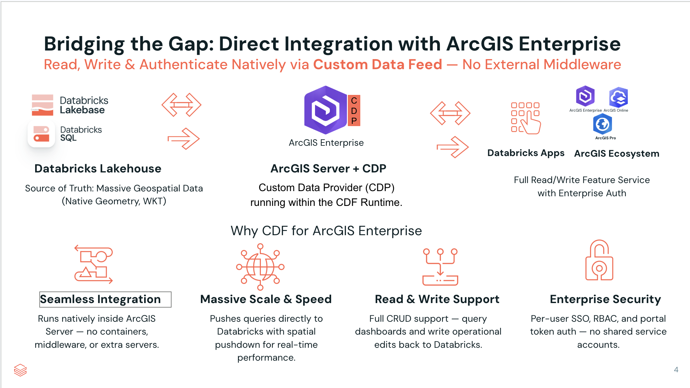
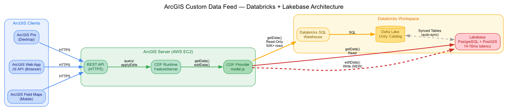
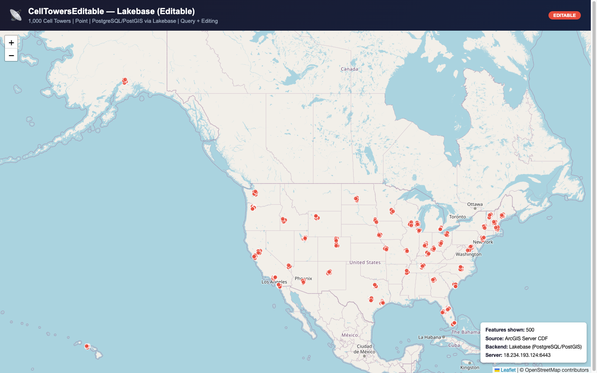

# ArcGIS Custom Data Feed Provider for Databricks

A Node.js Custom Data Provider that connects Databricks tables to ArcGIS Server as Feature Services. Supports two backends:

| Backend | Engine | Best for | Capabilities |
|---------|--------|----------|-------------|
| **Lakehouse** | Databricks SQL Warehouse | Large-scale analytics, complex queries across massive tables | Query |
| **Lakebase** | Databricks Managed PostgreSQL + PostGIS | Low-latency serving (sub-200ms spatial queries), interactive maps, feature editing | Query + Editing |

One provider is registered once; each Feature Service picks its backend via service parameters.

> **How to use this guide.** It's one linear install, top to bottom — no competing paths to choose between. Do it once on the ArcGIS Server host and you'll have a live Feature Service. Everything past the [Installation complete](#installation-complete) marker is reference (query params, performance, geometry, env vars, troubleshooting) you can skip until you need it.

**The install, end to end — everything runs on the ArcGIS Server host, except registering the provider in the browser-based Server Manager (Step 2):**

- **[Prerequisites](#prerequisites)** — an ArcGIS Server, a Databricks SQL Warehouse, network access, a Databricks token, and (recommended) the Databricks CLI.
- **[Step 1 — Build the provider package](#step-1--get-the-code-and-build-the-provider-package)** (`.cdpk`) on the server.
- **[Step 2 — Register the provider](#step-2--register-the-provider)** once, in the ArcGIS Server Manager GUI.
- **[Step 3 — Create your Databricks credential file](#step-3--configure-the-databricks-connection)** (`.databrickscfg`).
- **[Step 4 — Publish each table](#step-4--publish-your-feature-services)** as a Feature Service with the `publish-service.sh` wizard.
- **[Step 5 — Harden for production](#step-5--harden-for-production)**.

Publishing a Feature Service isn't exposed in the ArcGIS Server Manager GUI, so Step 4's **`publish-service.sh`** wizard does it for you — one prompt per field, no JSON to hand-edit and no admin token to mint yourself. (Advanced alternatives — scripting the raw REST call, or publishing from a Databricks agent — are covered in the reference sections once you've got the basics working.)

## Overview



## Architecture





## Project Structure

```
nodejs-provider/
  cdconfig.json               # CDF provider manifest (registered with ArcGIS Server)
  package.json
  .env.example                # Environment config template
  .databrickscfg.example      # Multi-workspace profile template
  src/
    index.js                  # Provider entry point
    model.js                  # getData/editData/authorize — routes between backends
    modules/
      # --- Shared ---
      workspaceResolver.js    # Resolves .databrickscfg profile → workspace + auth config
      sanitize.js             # SQL injection prevention
      translate.js            # Row-to-GeoJSON conversion
      filters.js              # filtersApplied metadata
      auditLog.js             # Query audit logging
      # --- Lakehouse backend ---
      connectionPool.js       # Databricks SQL connection pooling (keyed per workspace+warehouse)
      sql.js                  # Databricks SQL query builder
      geometry.js             # Spatial filter construction (with DE-9IM workarounds)
      geometryFormat.js       # WKT/WKB/GeoJSON format handling
      # --- Lakebase backend ---
      lakebasePool.js         # PostgreSQL connection pooling (pg module, workspace-aware)
      lakebaseQuery.js        # PostGIS SELECT query builder
      editSql.js              # INSERT/UPDATE/DELETE SQL builders
  test/                       # 362 unit tests (mocha + chai)

mcp-server/                   # MCP server: publish/manage CDF feature services from agents
  bin/cli.js                  # serve (stdio|http) + register-target + list-targets
  src/                        # tools over the ArcGIS admin API + Statement Execution API
  test/                       # 25 unit tests (mocha + chai)
```

## Setup

Work through the five steps in order. Almost everything runs **on the ArcGIS Server host** — the machine where ArcGIS Server is installed — so SSH into it first and stay there. (The one exception is registering the provider in Step 2, which you do in the browser-based Server Manager; if that browser is on a different machine, Step 2 tells you how to get the file there.) That's why the occasional `curl` example targets `https://localhost:6443/...` — `localhost` *is* the ArcGIS Server, because you're logged into it.

> **Which user runs what:**
> - **Your SSH user** (typically `ubuntu` on a fresh AWS AMI) runs the build and packaging work — `git clone`, `npm install`, `zip`, and `databricks configure`.
> - **`sudo` is required** for anything that reads or writes under `/opt/arcgis/` (the ArcGIS Server install tree). Editing `init_user_param.sh`, placing `.databrickscfg`, and tailing logs all need `sudo`.
> - **`sudo -u arcgis`** is used to start, stop, or restart ArcGIS Server itself, because the server processes run as the `arcgis` OS user. Example: `sudo -u arcgis /opt/arcgis/server/startserver.sh`.
> - Files you create under `/opt/arcgis/...` should be `chown arcgis:arcgis` so the server can read them.

### Prerequisites

Have these five things ready before you start. Each says how to get it.

**1. An ArcGIS Server, version 11.4 or later, with Custom Data Feeds enabled.** ArcGIS Server ships with its own Node.js runtime, so you don't install Node separately. If you want feature *editing* (not just read-only maps), use 12.0 or later.

**2. A Databricks SQL Warehouse.** In your Databricks workspace, go to **SQL Warehouses** in the left sidebar and note (or create) a running warehouse. This is what the provider queries. *(A Lakebase instance is optional — you only need one for very low-latency maps or feature editing. Everything works with just a SQL Warehouse.)*

**3. Databricks credentials — PAT or Service Principal (pick one).**

*Option A — Personal Access Token (PAT).* Simplest for a single-person deployment. Tied to your own account — no admin rights needed:

   - In your Databricks workspace, click your **name/avatar (top-right) → Settings → Developer**.
   - Next to **Access tokens**, click **Manage → Generate new token**.
   - Give it a name (e.g. `arcgis-cdf`), leave the default lifetime, and click **Generate**.
   - **Copy the token now** (it starts with `dapi…`) — Databricks shows it only once. You'll paste it in Step 3.

*Option B — Service Principal (SP) with OAuth M2M.* Recommended for production and shared deployments — a machine identity that doesn't depend on any individual's account and auto-refreshes its tokens:

   - In the **Databricks account console**, go to **Service Principals** and create a new SP (or use an existing one).
   - Assign the SP to your workspace and generate an **OAuth secret** — note the `client_id` and `client_secret`.
   - Grant the SP **CAN USE** on the SQL Warehouse.
   - You'll enter `client_id` and `client_secret` instead of a token in Step 3.

If you're not sure which to use, start with a PAT — it's easier to set up and you can switch to a service principal later without changing any Feature Service definitions.

*Whichever you pick, it needs data access — a token/SP alone is not enough.* Two independent layers must both be granted, to the **same identity** you'll use (your account for a PAT, the SP for OAuth M2M):

   - **Compute:** `CAN USE` on the SQL Warehouse (Lakehouse). Set in the warehouse's **Permissions** UI.
   - **Data (Unity Catalog):** `USE CATALOG` on the catalog, `USE SCHEMA` on the schema, and `SELECT` on the specific table or view. Without these, the warehouse runs but every query fails with a permissions error. *(Lakebase equivalent: `CONNECT` on the database, `USAGE` on the schema, `SELECT` on the table — plus `INSERT`/`UPDATE`/`DELETE` if you'll enable editing.)*

   Grant only what's needed for the tables you're publishing — table-level `SELECT`, not catalog-wide. If you don't administer Unity Catalog yourself, ask whoever does to run those grants for the identity.

**4. Network access from the ArcGIS Server to Databricks.** The ArcGIS Server needs to reach your workspace outbound. If it already has general internet access, you're fine — otherwise ask whoever manages your firewall / VPC / security group to open:

  | Destination | Port | Protocol | Used for |
  |---|---|---|---|
  | `<workspace>.cloud.databricks.com` | 443 | HTTPS | SQL Warehouse queries + Databricks API calls |
  | `<lakebase-instance>.database.cloud.databricks.com` | 5432 | PostgreSQL over TLS | Lakebase queries and edits (only if you use Lakebase) |

  Nothing needs to be opened *inbound* to Databricks. If your workspace uses [IP access lists](https://docs.databricks.com/aws/en/security/network/front-end/ip-access-list), add the ArcGIS Server's outbound IP to the allowlist — otherwise the first query fails with `HTTP 403`.

**5. The Databricks CLI (recommended).** A single self-contained program that (a) writes your credential file for you in [Step 3](#step-3--configure-the-databricks-connection) so you never hand-edit config, and (b) makes it easy to look up the values the publish wizard asks for. Install it **on the ArcGIS Server host**:

  ```bash
  curl -fsSL https://raw.githubusercontent.com/databricks/setup-cli/main/install.sh | sh
  databricks version    # confirm it installed
  ```

  > **No internet on the server?** The CLI is one static binary with no dependencies. On any connected machine, download the release for the server's OS/architecture from [the CLI releases page](https://github.com/databricks/cli/releases) — or have your platform team mirror that release through your internal artifact repository (Artifactory, Nexus, etc.) — copy the file to the server, unzip it, and move the `databricks` binary somewhere on the `PATH` (e.g. `/usr/local/bin`).

### Step 1 — Get the code and build the provider package

You can do this **on the ArcGIS Server box itself**, or on any machine with package-registry access and copy the resulting `.cdpk` over — see the note below on why.

> **What the build actually requires — and what it does *not*.**
> - **It needs a package registry.** `node_modules/` is not shipped in this repo, so `npm install` downloads dependencies. This is the one part of the whole process that is *not* air-gapped; everything after it (register, publish, diagnose) is.
> - **It does *not* require compiling on the server's OS.** As of the pinned `@databricks/sql`, the provider has **no *required* native modules** — its one native dependency, `lz4` (a compression accelerator), is an `optionalDependency` loaded in a try/catch, so when it's absent the driver simply **continues without lz4 compression** (no crash). That means **a `.cdpk` built on any OS (even your laptop) loads and runs on the Linux server.** The only reason to build on `linux-x64` matching the server's bundled Node is if you specifically want `lz4` compression on large result transfers — a performance nicety, not correctness.
> - **So for a fully offline box:** build the `.cdpk` on *any* machine that has registry (or internal-proxy) access, copy it over, and register it via the Server Manager GUI ([Step 2](#step-2--register-the-provider)) or `register-provider.sh` **option 2** ("register an existing .cdpk").

> **⚠️ GovCloud (`.databricks.mil` / `.databricks.us`) + OAuth M2M — a build-time patch is needed.** The bundled `@databricks/sql` driver hardcodes an OAuth domain allowlist (`.cloud.databricks.com`, `.dev.databricks.com`, plus the Azure domains) and throws `OAuth is not supported for <host>` on GovCloud hosts. Two options: **(a) use a PAT** instead of OAuth M2M — a PAT skips the OAuth path entirely and works on GovCloud unchanged (simplest); or **(b)** if you need OAuth M2M, patch the driver's allowlist to include `.cloud.databricks.mil` / `.cloud.databricks.us` and rebuild the `.cdpk`. Because a plain `npm install` overwrites `node_modules`, this patch must be captured so every rebuild reapplies it (e.g. `patch-package`) — otherwise `register-provider.sh`'s build and any fresh `npm install` silently drop it. Track this per deployment until the patch is committed to the repo.

The provider's source lives in the **`nodejs-provider/` subdirectory at the root of this repo** (see [Project Structure](#project-structure) above). Clone the repo on the server and `cd` into that subdirectory before running `npm install`:

```bash
git clone <this-repo-url>                # clones into ./esri-customdatafeed/
cd esri-customdatafeed/nodejs-provider   # provider source + cdconfig.json + package.json live here
npm install
```

> **If `npm` errors with `Cannot find module '../lib/cli.js'`:** on some installs the ArcGIS-bundled `npm` launcher is broken (and there may be no system npm at all). Invoke npm through the bundled Node directly — same `install` semantics, just explicit paths:
> ```bash
> /opt/arcgis/server/framework/runtime/node/bin/node \
>   /opt/arcgis/server/framework/runtime/node/lib/node_modules/npm/bin/npm-cli.js install
> ```
> The bundled Node binary is typically mode `700`, owned by the `arcgis` OS user — if you're logged in as a different user (e.g. `ubuntu`) you'll get *Permission denied*; prefix the command with `sudo -u arcgis`. Use the same pattern for any other npm command on the server. Building with the bundled Node is preferred anyway — it guarantees native modules compile against the exact Node version the CDF runtime uses.

Then package the provider as a **`.cdpk`** (a zip archive with a different extension) — [Step 2](#step-2--register-the-provider) uploads it. Run this from the same `nodejs-provider/` directory:

```bash
# Keep the .env excludes EXACTLY as written. A wildcard like '*.env*' would also strip
# node_modules files whose names contain ".env" (e.g. @dabh/diagnostics/adapters/process.env.js,
# a transitive dep of @databricks/sql) — the broken package then fails provider validation at
# register time with "Cannot find module '../adapters/process.env'".
# Run this from the nodejs-provider directory — the same one where you just ran npm install.
zip -r databricks-geospatial-provider.cdpk \
  cdconfig.json package.json package-lock.json src/ node_modules/ \
  -x '.env' '.env.*' 'test/*' '*.md'
```

You now have `databricks-geospatial-provider.cdpk` ready to register.

### Step 2 — Register the provider

This is a **one-time** action that tells ArcGIS Server "the Databricks CDF provider exists and is available to use." You only do it again when you change the provider's source code. Publishing individual Feature Services against the registered provider is [Step 4](#step-4--publish-your-feature-services).

> **Prefer a script? `register-provider.sh` does Step 1 + Step 2 in one wizard.** Run [`register-provider.sh`](register-provider.sh) on the box (companion to the publish wizard, same bash + curl + python3) and it builds the `.cdpk` from `nodejs-provider/`, mints the admin token, and registers it. *Its build path (option 1) needs a package registry like Step 1; on a fully offline box, build the `.cdpk` on any machine with registry access and use the script's **option 2** to register the existing package — that path, and everything after it, is air-gapped. (The provider has no required native modules, so the `.cdpk` isn't OS-specific — see the Step 1 note.)* The script **updates** rather than registers if the provider already exists (with a warning first, since an update re-extracts the provider directory — and it now snapshots the live provider dir so a failed update can be rolled back). It auto-detects the install root (`/opt/arcgis` **or** `/app/arcgis`) and restarts the server for you. `sudo bash register-provider.sh` (or `--help`). The GUI steps below are the click-through equivalent.

Do this in the **ArcGIS Server Manager** web app — the same admin site you use to manage your server. It needs no command line and no tokens:

1. Open **ArcGIS Server Manager** and sign in.
2. Go to **Site (Server Configuration) → Custom Data Feeds**.
3. Click **Add Custom Data Provider** and browse to the `databricks-geospatial-provider.cdpk` you built in Step 1.
4. Confirm. The provider now appears in the Custom Data Feeds list.

The **Name** shown in that list — `databricks-geospatial-provider` — is the provider name you'll point Feature Services at later. That's all Step 2 requires.

> **Opening Server Manager from your laptop, not the server?** That's normal — Server Manager is a web app. But its **Add Custom Data Provider** file picker sees only the machine the *browser* runs on, and you built the `.cdpk` on the server in Step 1. Copy it down to that machine first, e.g. `scp user@arcgis-host:~/esri-customdatafeed/nodejs-provider/databricks-geospatial-provider.cdpk .`, then browse to the local copy. (No browser access at all? Use the command-line alternatives below.)

<details>
<summary><b>No access to Server Manager? (advanced alternatives)</b></summary>

If you can't use the GUI (automation, or a locked-down box with no admin site), register from the command line instead — pick one:

**ArcGIS Enterprise SDK `cdf` CLI** — install the [ArcGIS Enterprise SDK](https://developers.arcgis.com/enterprise-sdk/) (it ships the `cdf` tool), then:

```bash
cdf register databricks-geospatial-provider.cdpk https://your-server:6443/arcgis/admin
```

It prompts for your `siteadmin` credentials and does the upload + register in one step. For self-signed certs, set `NODE_EXTRA_CA_CERTS=/path/to/cert.pem` (or `NODE_TLS_REJECT_UNAUTHORIZED=0`) first.

**Admin REST API** — the fully scripted path. Here `TOKEN` is an *ArcGIS Server admin token* (not your Databricks PAT); `client=requestip` binds it to your IP so no `Referer` header is needed (see [Admin token binding](#admin-token-binding-requestip-vs-referer) if minting misbehaves):

```bash
# (a) Mint the admin token (siteadmin login; run on the box, use your real password).
TOKEN=$(curl -sk -X POST 'https://localhost:6443/arcgis/admin/generateToken?f=json' \
  --data-urlencode 'username=siteadmin' \
  --data-urlencode 'password=...' \
  --data-urlencode 'client=requestip' \
  | python3 -c 'import sys,json; print(json.load(sys.stdin)["token"])')

# (b) Upload the .cdpk. The response contains an itemID — copy it for the next command.
curl -k "https://localhost:6443/arcgis/admin/uploads/upload?token=$TOKEN&f=json" \
  -F "itemFile=@databricks-geospatial-provider.cdpk"
# Returns: {"status":"success","item":{"itemID":"i273bb53a-..."}}   <-- copy this itemID

# (c) Register the upload — paste the itemID from (b). register is FIRST install only.
curl -k "https://localhost:6443/arcgis/admin/services/types/customdataproviders/register?token=$TOKEN&f=json" \
  --data-urlencode "id=ITEM_ID_FROM_UPLOAD_RESPONSE"
```

**From an agent:** the [MCP server's](#7-agent-driven-publishing-mcp-server) `register_provider` tool does the upload/register/update flow for you — and can bake `.env` config into the package so upgrades can't wipe it.

</details>

<details>
<summary><b>Upgrading or removing the provider later</b> (not needed for a first install)</summary>

**Upgrading the provider** (new code, same provider name): registering again is refused — *"Custom data provider with name '...' is already registered"*. Rebuild the `.cdpk`, then in the GUI use the provider's **edit/update** action, or via REST upload the new `.cdpk` and call **`update`** instead of `register`:

```bash
curl -k "https://localhost:6443/arcgis/admin/services/types/customdataproviders/update?token=$TOKEN&f=json" \
  --data-urlencode "id=ITEM_ID_FROM_UPLOAD_RESPONSE"
```

To retire a provider instead, unregister it by `.cdpk` filename (REST): `.../customdataproviders/unregister` with `--data-urlencode "customdataFilename=old-provider-name.cdpk"`. Restart the server afterward either way.

</details>

> **What just happened.** Registration extracts your `.cdpk` into `/opt/arcgis/server/framework/runtime/customdata/providers/databricks-geospatial-provider/` and validates it by starting the provider with the bundled Node runtime. The server places the files automatically — you don't copy anything manually. The `git clone` in your home directory and the `.cdpk` were just staging artifacts.
>
> **After registration — every time:**
> 1. **Restart ArcGIS Server** (`sudo -u arcgis /opt/arcgis/server/stopserver.sh` then `startserver.sh`) so the new code loads.
>
> **Nothing else to do.** Credentials live in `.databrickscfg` at `/home/arcgis/.databrickscfg` — outside the provider directory — and are never touched by a `.cdpk` extraction. This is why Step 3 uses that location.

### Step 3 — Configure the Databricks connection

The provider logs in to Databricks by reading a small credential file called **`.databrickscfg`** — the standard Databricks config file. You don't have to write it by hand: the Databricks CLI from [Prerequisites](#prerequisites) creates it for you.

**Create the file with the CLI.** On the server, run:

```bash
databricks configure --token
```

It asks two questions:

- **Databricks Host** — your workspace URL, e.g. `https://your-workspace.cloud.databricks.com`.
- **Personal Access Token** — paste the `dapi…` token you generated in [Prerequisites step 3](#prerequisites).

That writes a file named `.databrickscfg` in your home directory with a section called `[DEFAULT]` — exactly what the publish wizard expects. To confirm it works:

```bash
databricks current-user me    # prints your username if the token and host are good
```

**Move it where ArcGIS Server can read it.** ArcGIS Server runs as a separate OS user called `arcgis`, which reads the file from its *own* home directory. Copy your file there and lock down its permissions:

```bash
sudo cp ~/.databrickscfg /home/arcgis/.databrickscfg
sudo chown arcgis:arcgis /home/arcgis/.databrickscfg
sudo chmod 600 /home/arcgis/.databrickscfg
```

That's Step 3 done. If you'd rather write the file by hand, a PAT profile is just:

```ini
[DEFAULT]
host  = your-workspace.cloud.databricks.com
token = dapi_your_pat_here
```

> **Prefer a service principal (OAuth M2M), or serving more than one workspace?** Same file, same location, same `chown`/`chmod` — only the profile contents differ (`client_id`/`client_secret` instead of `token`, and one section per workspace). Full profiles and setup are in [Credentials: service principals & multiple workspaces](#multiple-workspaces-or-oauth-m2m) in the reference section. A single `[DEFAULT]` PAT profile is all most deployments need.

#### Multiple Workspaces or OAuth M2M

*Reference — most first-time installs skip this entirely.* The `[DEFAULT]` profile from Step 3 already covers you; continue to [Step 4](#step-4--publish-your-feature-services). Expand this only if you need a **service principal (OAuth M2M)** instead of a PAT, or **more than one workspace** served by the same ArcGIS Server.

<details>
<summary><b>Expand: service-principal profiles, multi-workspace setup, and troubleshooting</b></summary>

Use this section if you need either of:
- **Multiple Databricks workspaces** served by the same ArcGIS Server (one Feature Service per workspace, with isolated connection pools per workspace), OR
- **Service-principal OAuth M2M auth** (recommended for production — a machine identity with `client_id`+`client_secret` that auto-refreshes tokens, instead of a long-lived PAT tied to a user).

Both modes work for Lakehouse and Lakebase. You configure them through a `.databrickscfg` file — the same one the Databricks CLI uses.

##### `.databrickscfg` profiles

The provider reads `~/.databrickscfg` (or the path in `DATABRICKS_CONFIG_FILE`) — same format used by the Databricks CLI / Asset Bundles / dbt. See [`.databrickscfg.example`](nodejs-provider/.databrickscfg.example) for a copy-paste template.

```ini
# PAT (Personal Access Token)
[WORKSPACE_A]
host  = workspace-a.cloud.databricks.com
token = dapiXXXXXXXXXXXXXXXXX

# OAuth M2M (service principal — recommended for production)
[WORKSPACE_B]
host          = workspace-b.cloud.databricks.com
client_id     = <service-principal-client-id>
client_secret = <service-principal-secret>
```

- Each profile uses **one** auth mode — either `token` (PAT) **or** `client_id` + `client_secret` (OAuth M2M). Mixing both in one profile errors at request time.
- Different profiles can use different auth modes independently — all-PAT, all-OAuth M2M, or any mix.
- Add a profile per workspace.

##### Default profile resolution

When a service is created **without** a `workspace` parameter:

1. If a `[DEFAULT]` profile exists in `.databrickscfg`, it's used.
2. Otherwise, env vars (`DATABRICKS_SERVER_HOSTNAME` + `DATABRICKS_ACCESS_TOKEN`) form a synthesized default.
3. If neither is set, the service errors at request time.

If you go all-in on `.databrickscfg`, leave the `DATABRICKS_*` credential env vars in `.env` empty (or delete those lines) — the resolver picks `.databrickscfg` `[DEFAULT]` first, and empty/missing env vars avoid any chance of mismatched credentials.

##### Example: services pointing at different workspaces

Using the two profiles from the snippets above (`[WORKSPACE_A]` PAT and `[WORKSPACE_B]` OAuth M2M), here's how a Lakehouse service and a Lakebase service register against different workspaces — full createService payloads are in [Manual service creation](#manual-service-creation-admin-rest-api--reference) below.

```json
// Lakehouse service → workspace A (PAT)
"serviceParameters": {
  "workspace": "WORKSPACE_A",
  "warehouseHttpPath": "/sql/1.0/warehouses/aaaa",
  "tableName": "catalog_a.geo.cells",
  "geometryColumn": "geometry",
  "idField": "id"
}

// Lakebase service → workspace B (OAuth M2M)
"serviceParameters": {
  "workspace": "WORKSPACE_B",
  "lakebaseHost": "instance-bbbb.database.cloud.databricks.com",
  "lakebasePort": "5432",
  "lakebaseDatabase": "geospatial",
  "lakebaseTable": "buildings",
  "geometryColumn": "geometry",
  "idField": "id"
}
```

For OAuth M2M Lakebase services, the provider exchanges `client_id`/`client_secret` at the workspace's `/oidc/v1/token` endpoint, then uses that token to call `/api/2.0/database/credentials` for the Lakebase OAuth token. Auto-refreshes ~5 minutes before expiry.

##### Service principal setup (OAuth M2M)

Per workspace, in the Databricks account console:

1. Create a service principal (or reuse an existing one).
2. Assign the SP to the workspace.
3. Generate an OAuth secret — save the `client_id` and `client_secret`.
4. Grant the SP `CAN_USE` on the SQL warehouse.
5. For Lakebase: grant the SP database-level access on the Lakebase instance.

Reference: [Authorize service principal access with OAuth M2M](https://docs.databricks.com/aws/en/dev-tools/auth/oauth-m2m).

##### `.databrickscfg` location on ArcGIS Server

ArcGIS Server runs as the `arcgis` OS user and reads `~/.databrickscfg`, so put the file at **`/home/arcgis/.databrickscfg`** and make it readable by that user:

```bash
sudo chown arcgis:arcgis /home/arcgis/.databrickscfg
sudo chmod 600 /home/arcgis/.databrickscfg
```

If the `arcgis` user has no home directory on your system, put the file anywhere `arcgis` can read and set `DATABRICKS_CONFIG_FILE` to that path in [`init_user_param.sh`](#set-environment-variables-in-init_user_paramsh).

##### Verifying it works

Provider logs (append `/logz` to the app URL, or tail `/opt/arcgis/server/usr/logs/*/server/server-*.log`) will show distinct connection pools per workspace:

```
[Pool WORKSPACE_A|/sql/1.0/warehouses/abc123] Initialized (min: 2, max: 10)
[Pool WORKSPACE_B|/sql/1.0/warehouses/xyz789] Initialized (min: 2, max: 10)
```

##### Multi-workspace troubleshooting

| Symptom | Likely cause |
|---|---|
| `Databricks workspace profile "X" not found` | Profile name typo (case-sensitive), wrong `DATABRICKS_CONFIG_FILE`, or file isn't readable by the `arcgis` user |
| `Profile [X] is ambiguous: defines both PAT and OAuth M2M` | Pick one — comment out either `token` OR `client_id`+`client_secret` |
| `OAuth M2M token endpoint returned 401` | SP `client_id`/`client_secret` is wrong/revoked, or SP isn't assigned to the workspace |
| `No Lakebase instance found with hostname X in workspace Y` | The `lakebaseHost` belongs to a different workspace than the `workspace` profile points at |
| `Source IP address X is blocked by Databricks IP ACL` | The ArcGIS Server's outbound IP isn't on that workspace's IP allowlist (workspace-level setting in Databricks, separate from CDF) |
| Single-workspace deployment stopped resolving credentials | `/home/arcgis/.databrickscfg` missing, unreadable by the `arcgis` user, or its `[DEFAULT]` profile was removed — the resolver checks `[DEFAULT]` first, then env vars |

</details>

#### If you'll use the Lakebase backend

Skip this if you only need Lakehouse (read-only SQL Warehouse) services.

**One-time Lakebase database setup:** enable PostGIS on each database the provider will use — `CREATE EXTENSION IF NOT EXISTS postgis;`. The provider's Lakebase queries and edits rely on PostGIS geometry types and ST_* functions; without it the first query fails with `function st_intersects does not exist`.

> **Heads-up if your Lakebase table is populated via Databricks Synced Tables** (the reverse-ETL feature that copies a Unity Catalog table into Lakebase): Databricks Sync **does not carry GEOMETRY or GEOGRAPHY columns** — the sync will fail if your source Delta table has them. The fix is to store geometry as WKT in a STRING column on the Databricks side, sync that, and either convert at query time or via a generated column on the Lakebase side. Full details and the workaround SQL are in [Known Limitations → Lakebase Synced Tables](#lakebase-synced-tables-geometrygeography-types-not-supported). If you're creating your Lakebase table directly (not via sync), ignore this — native PostGIS geometry works fine.

No extra provider-side config is needed for Lakebase. Per-table connection details (`lakebaseHost`, `lakebaseDatabase`, etc.) go on each Feature Service when you create it (the [Step 4](#step-4--publish-your-feature-services) wizard prompts for them). Authentication is automatic — the provider uses your PAT (or the resolved workspace profile in multi-workspace setups) to mint short-lived Lakebase OAuth tokens, auto-refreshing them before expiry.

To bypass automatic token minting and use a fixed credential (testing, CI), set `LAKEBASE_PASSWORD` in `.env`. Other Lakebase tuning vars (`LAKEBASE_POOL_MIN/MAX`, `LAKEBASE_SSL_VERIFY`) are documented in [`.env.example`](nodejs-provider/.env.example).

### Step 4 — Publish your feature services

This is what you do for **each** Databricks table you want to expose as a Feature Service. The **[`publish-service.sh`](publish-service.sh)** wizard is the recommended way — it builds the `createService` payload for you, so there's no JSON to hand-edit and no admin token to mint yourself.

Run it **on the ArcGIS Server box**, as **root** (simplest) or the `arcgis` user. The script lives at the **repository root** — not in the `nodejs-provider/` subdirectory you were in for Steps 1–2 — so `cd` back up first:

```bash
cd ~/esri-customdatafeed        # the repo root you cloned in Step 1
sudo bash publish-service.sh
```

It:
- **Preflights** the environment and stops with a clear message if the provider isn't registered ([Step 2](#step-2--register-the-provider)) or the config isn't in place ([Step 3](#step-3--configure-the-databricks-connection)).
- **Auto-detects** the registered provider and lists your `.databrickscfg` profiles to pick from.
- Lets you choose the **backend** — Lakehouse (SQL Warehouse, read-only) or Lakebase (Postgres + PostGIS, read/write with editing).
- Asks for the connection, workspace, and warehouse (or Lakebase instance) **once**, then **loops per table** — after each service it asks whether to publish another from the same source.
- Prompts for **instance sizing** (`min`/`max` instances per node — warm-by-default `min=1` to avoid the intermittent-404 cold-start) and an optional **Advanced options** gate (default No) for **visibility** (mark the service private — denies anonymous `esriEveryone` access) and **`maxIdleTime`**.
- Leaves the geometry format on **auto-detect** unless you override it, shows a **review summary** before creating, then **creates → starts → verifies** each service with a live query and prints its FeatureServer URL — plus an **anonymous-access probe** that confirms whether the service is readable without a token.

Prefer to script the payload yourself, or need to understand every parameter? See [Manual service creation (Admin REST API)](#manual-service-creation-admin-rest-api--reference). To publish from Databricks Playground or Claude instead, see [Section 7](#7-agent-driven-publishing-mcp-server).

### Step 5 — Harden for production

These steps harden the deployment for production. Skip if you're just trying the provider locally — Steps 1-4 alone will work.

> **Where things live on the ArcGIS Server box.** A Linux install lands under `/opt/arcgis/server/` by default, **but hardened sites often install under `/app/arcgis/server/`** — check with `ls -d /opt/arcgis /app/arcgis 2>/dev/null`, and substitute your actual root everywhere `/opt/arcgis` appears below. On Windows the equivalent is typically `C:\Program Files\ArcGIS\Server\`. (`register-provider.sh` and `diagnose-service.sh` auto-detect `/opt` vs `/app`; the copy-paste commands here do not, so adjust them by hand.) The paths in the rest of this section assume the Linux default. Edits to files under `/opt/arcgis/` need `sudo`, and any change requires a server restart (`sudo -u arcgis /opt/arcgis/server/stopserver.sh` then `startserver.sh`). If you want to verify the install state before/after changes, jump to the [sanity-check block](#troubleshooting) at the top of Troubleshooting.

#### Set environment variables in `init_user_param.sh`

ArcGIS Server reads a startup script (typically at `/opt/arcgis/server/usr/init_user_param.sh` on Linux) and exports anything in it as environment variables for the embedded Node.js runtime. Use it to set the path to your `.databrickscfg` (so the provider finds it regardless of where the `arcgis` OS user's home directory is) and any operational tuning variables — pool sizes, query timeouts, audit logging:

```bash
# /opt/arcgis/server/usr/init_user_param.sh

# Path to the Databricks credential file (host + token or OAuth M2M).
# Required if the arcgis user's home directory isn't /home/arcgis.
export DATABRICKS_CONFIG_FILE=/home/arcgis/.databrickscfg

# Default SQL Warehouse HTTP path.
# Required unless every Feature Service sets warehouseHttpPath explicitly
# (the publish-service.sh wizard sets it per-service, so this is a fallback).
export DATABRICKS_HTTP_PATH=/sql/1.0/warehouses/your-warehouse-id

# Optional tuning (leave at defaults unless you have a reason to change)
# export DATABRICKS_MAX_RECORD_COUNT=2000
# export DATABRICKS_QUERY_TIMEOUT=120000
# export ENABLE_AUDIT_LOG=false
```

Restart ArcGIS Server after editing `init_user_param.sh`. Host and token credentials stay in `.databrickscfg` — not here — so they're in one place and never duplicated across config files.

#### Admin token binding: `requestip` vs `referer`

When you call `generateToken`, the `client` parameter decides what the token is bound to. The two practical options:

- **`client=requestip` (recommended for the admin calls in this guide).** The token is tied to the IP that requested it, so no `Referer` header is needed on the `/arcgis/admin/...` calls (upload, register, createService, start) — simplest and least error-prone when running curl on the box against `localhost`. This is what [Step 2](#step-2--register-the-provider) uses.
- **`client=referer`.** The token is tied to a referer URL, and *every* subsequent `/arcgis/admin/...` call must send a `Referer` header that matches the `referer=` value you passed at generation time. Any mismatch returns `HTTP 498 — "Invalid token, ClientID does not match"`, or a JSON error object with no `token` key (which breaks `json.load(...)["token"]` parsing). Use this only if your environment can't rely on a stable request IP.

> **Querying a feature service is different.** The public feature-service `/query` endpoint validates tokens more strictly and may reject a `requestip` token with `HTTP 498`. Query it with a `referer`-bound token **plus a matching `Referer` header** — the [`publish-service.sh` wizard](#step-4--publish-your-feature-services) does exactly this for its verification step.

```bash
# requestip — token bound to your IP; no Referer header on these admin calls
TOKEN=$(curl -sk -X POST 'https://localhost:6443/arcgis/admin/generateToken?f=json' \
  --data-urlencode 'username=siteadmin' \
  --data-urlencode 'password=...' \
  --data-urlencode 'client=requestip' \
  | python3 -c 'import sys,json; print(json.load(sys.stdin)["token"])')

# subsequent ADMIN calls just pass the token — no Referer (a feature-service /query still needs a referer token, see above)
curl -sk "https://localhost:6443/arcgis/admin/services?token=$TOKEN&f=json"
```

```bash
# referer alternative — the referer= value AND the Referer header on every call must agree
TOKEN=$(curl -sk -X POST 'https://your-server:6443/arcgis/admin/generateToken?f=json' \
  -H 'Referer: https://your-server:6443' \
  --data-urlencode 'username=siteadmin' \
  --data-urlencode 'password=...' \
  --data-urlencode 'client=referer' \
  --data-urlencode 'referer=https://your-server:6443' \
  | python3 -c 'import sys,json; print(json.load(sys.stdin)["token"])')

# EVERY subsequent admin call must then repeat the matching Referer header
curl -sk -H "Referer: https://your-server:6443" \
  "https://your-server:6443/arcgis/admin/services?token=$TOKEN&f=json"
```

---

> ### Installation complete
>
> With the provider registered and at least one Feature Service created, you have a working deployment. **Everything below this point is reference material** — supported query parameters, performance benchmarks, geometry format details, environment-variable reference, and troubleshooting. Skim or skip ahead as needed.

---

## Manual service creation (Admin REST API) — reference

The [`publish-service.sh` wizard](#step-4--publish-your-feature-services) (Step 4) is the recommended way to create services — it builds and submits the payload below for you. This section documents the raw Admin REST API `createService` call for scripting it yourself or understanding every parameter.

> **Agent shortcut:** the [MCP server's](#7-agent-driven-publishing-mcp-server) `publish_layer` tool does everything here from one sentence — it inspects the table, derives all service parameters (geometry column/format, SRID, a validated id field), creates the service, and smoke-tests it live.

In [Step 2](#step-2--register-the-provider) you registered the provider — that was a one-time install. **Creating a Feature Service is a separate REST call per table**, against a different admin endpoint (`/createService` instead of `/customdataproviders/register`). Each service points at one table via service parameters, and the presence of `lakebaseHost` determines which backend (Lakehouse or Lakebase) is used.

> **Before you start — your source table must satisfy:**
>
> - **`idField` is an integer column with unique values in the range 0 – 2,147,483,647.** ArcGIS uses this as OBJECTID. Both INT and BIGINT work (Databricks BIGINT is read back as a string and cast to a number).
> - **Geometry uses `lon lat` order** (the GIS standard). If you store WKT, write `POINT(lon lat)`, not `POINT(lat lon)`.
> - **Lakehouse only**: table name must be fully qualified (`catalog.schema.table`), and the SQL warehouse must be running (serverless adds a ~5–15s cold-start to the first query).
> - **Lakebase only**: the geometry column is native PostGIS geometry.
>
> If your source table has only `latitude` / `longitude` columns instead of a geometry column, see [Working with Existing Tables](#working-with-existing-tables) for the view pattern.

### Lakehouse Service Parameters

| Parameter | Required | Default | Description |
|-----------|----------|---------|-------------|
| `workspace` | No | env-default | Profile name from `.databrickscfg` (see [Multiple Workspaces or OAuth M2M](#multiple-workspaces-or-oauth-m2m)). If empty, uses `DATABRICKS_SERVER_HOSTNAME` + `DATABRICKS_ACCESS_TOKEN` env vars. |
| `warehouseHttpPath` | No | `DATABRICKS_HTTP_PATH` env | SQL warehouse HTTP path (e.g. `/sql/1.0/warehouses/abc123`). Override per-service if you have multiple warehouses. |
| `tableName` | Yes | - | Fully qualified table name (`catalog.schema.table`) |
| `geometryColumn` | No | `geometry` | Name of the geometry column |
| `idField` | No | `id` | Integer primary key column (used as OBJECTID) |
| `geometryFormat` | No | auto-detect | `WKT`, `WKB`, `GEOJSON`, or `GEOMETRY` (native). See [Geometry Support](#geometry-support) for when you need to set this explicitly. |
| `timeColumn` | No | - | Timestamp column for time-aware queries |
| `maxRecordCount` | No | `2000` | Max features returned per page (clients can request fewer) |
| `srid` | No | `4326` | EPSG SRID of the geometry column |

### Lakebase Service Parameters

Setting `lakebaseHost` routes a service to Lakebase instead of Lakehouse.

| Parameter | Required | Default | Description |
|-----------|----------|---------|-------------|
| `workspace` | No | env-default | Profile name from `.databrickscfg` — see [Multiple Workspaces or OAuth M2M](#multiple-workspaces-or-oauth-m2m). Determines which workspace mints Lakebase OAuth tokens. |
| `lakebaseHost` | Yes | - | Lakebase instance hostname |
| `lakebasePort` | No | `5432` | PostgreSQL port |
| `lakebaseDatabase` | Yes | - | Database name |
| `lakebaseSchema` | No | `public` | PostgreSQL schema |
| `lakebaseTable` | Yes | - | Table name |
| `geometryColumn` | No | `geometry` | Geometry column (PostGIS native) |
| `idField` | No | `id` | Integer primary key column (used as OBJECTID) |
| `maxRecordCount` | No | `2000` | Max features returned per page (clients can request fewer) |
| `srid` | No | `4326` | EPSG SRID of the geometry column |
| `editingEnabled` | No | `false` | Set to `true` to enable applyEdits (also requires `capabilities: "Query,Editing"`) |

Editing is enabled at the provider level (`editingEnabled: true` in [`cdconfig.json`](nodejs-provider/cdconfig.json)). To actually expose editing on a service, set `"capabilities": "Query,Editing"` and `"editingEnabled": "true"` in the `createService` call. Lakebase services work for read-only use cases too — just set `"capabilities": "Query"`.

### Examples

Create services via the **Admin REST API** (`createService` endpoint). All service parameters from `cdconfig.json` must be included — use empty strings for parameters that don't apply.

> **Note:** There is no `cdf create-service` CLI command. Services are created through the [`publish-service.sh` wizard](#step-4--publish-your-feature-services), the Admin REST API, or the ArcGIS Server Admin Directory UI. Services may be created in a STOPPED state — start them via the Admin API (`services/<name>.FeatureServer/start`) or the ArcGIS Server Manager UI.

#### Lakehouse service (read-only)

```bash
curl -k "https://localhost:6443/arcgis/admin/services/createService?token=$TOKEN&f=json" \
  --data-urlencode 'service={
    "serviceName": "MyCellTowers",
    "type": "FeatureServer",
    "capabilities": "Query",
    "provider": "CUSTOMDATA",
    "clusterName": "default",
    "minInstancesPerNode": 0, "maxInstancesPerNode": 0,
    "instancesPerContainer": 1,
    "configuredState": "STARTED",
    "properties": {"disableCaching": "true"},
    "jsonProperties": {
      "customDataProviderInfo": {
        "dataProviderName": "databricks-geospatial-provider",
        "serviceParameters": {
          "workspace": "",
          "warehouseHttpPath": "",
          "tableName": "catalog.schema.us_cell_towers",
          "geometryColumn": "geometry",
          "idField": "id",
          "geometryFormat": "WKT",
          "timeColumn": "",
          "lakebaseHost": "",
          "lakebasePort": "",
          "lakebaseDatabase": "",
          "lakebaseSchema": "",
          "lakebaseTable": "",
          "maxRecordCount": "2000",
          "srid": "4326",
          "editingEnabled": ""
        }
      }
    }
  }'
```

#### Lakebase service (read + write)

```bash
curl -k "https://localhost:6443/arcgis/admin/services/createService?token=$TOKEN&f=json" \
  --data-urlencode 'service={
    "serviceName": "CellTowersEditable",
    "type": "FeatureServer",
    "capabilities": "Query,Editing",
    "provider": "CUSTOMDATA",
    "clusterName": "default",
    "minInstancesPerNode": 0, "maxInstancesPerNode": 0,
    "instancesPerContainer": 1,
    "configuredState": "STARTED",
    "properties": {"disableCaching": "true"},
    "jsonProperties": {
      "customDataProviderInfo": {
        "dataProviderName": "databricks-geospatial-provider",
        "serviceParameters": {
          "workspace": "",
          "warehouseHttpPath": "",
          "tableName": "",
          "geometryColumn": "geometry",
          "idField": "id",
          "geometryFormat": "",
          "timeColumn": "",
          "lakebaseHost": "instance-xxx.database.cloud.databricks.com",
          "lakebasePort": "5432",
          "lakebaseDatabase": "geospatial",
          "lakebaseSchema": "public",
          "lakebaseTable": "cell_towers",
          "maxRecordCount": "2000",
          "srid": "4326",
          "editingEnabled": "true"
        }
      }
    }
  }'
```

### How Routing Works

The provider routes automatically — no configuration needed beyond service parameters:

```
getData(req) → lakebaseHost set? → YES: PostgreSQL path / NO: Databricks SQL path
editData(req) → Always Lakebase (Lakehouse is read-only)
```

## 7. Agent-driven publishing (`mcp-server/`)

 — the provider above is the mature component; this MCP layer is newer (core flows tested end-to-end against a live ArcGIS Server; see its [README](mcp-server/README.md) for the current status).

An MCP server that turns provider setup **and** per-layer publishing into a conversation. Instead of hand-building `createService` JSON, an agent inspects the Unity Catalog table (geometry column/format, SRID, int32-safe unique id, time column — all derived automatically), publishes it as a feature service, smoke-tests it live, and returns the FeatureServer URL. Given a built `.cdpk`, it also installs and upgrades the provider itself — with environment config **baked into the package**, so the ".cdpk update wiped my `.env`" failure mode (see the update warning in [Step 2](#step-2--register-the-provider)) can't happen.

### Quickstart (local, Claude Code / Claude Desktop)

Three steps, most of it conversation. Full walkthrough (Claude Code + Claude Desktop config, security notes) in [`mcp-server/README.md`](mcp-server/README.md).

```bash
git clone https://github.com/anandtrivedi/esri-customdatafeed.git
cd esri-customdatafeed/mcp-server && npm install
claude mcp add databricks-cdf -- node "$(pwd)/bin/cli.js" serve
```

Then in the client:
1. *"Register my ArcGIS server at https://gis.example.com:6443/arcgis/admin (user siteadmin, Databricks profile DEFAULT, warehouse abc123) as `my-gis`."* — the agent saves the target and prints one `set-password` command to run in a terminal (the password is never typed into chat).
2. *"install the Databricks provider on my-gis from ./nodejs-provider"* — builds and registers the CDF provider (skip if it's already installed).
3. *"publish catalog.schema.my_table to my-gis"* — or *"why can't I publish this table?"* (inspection reports blocking problems with the fix named).

### Tools

| Tool | What it does |
|------|--------------|
| `register_gis_target` | Onboard an ArcGIS Server by conversation — saves everything except the password, returns the one-line `set-password` command to run in a terminal |
| `list_gis_targets` | Registered ArcGIS targets (credentials never shown) |
| `test_connectivity` | Mints an ArcGIS admin token + probes the SQL warehouse |
| `provider_status` | Is the CDF `.cdpk` registered, version, editing enabled |
| `register_provider` | Install/upgrade the provider from a `.cdpk` **or build it from the source directory** (`sourcePath`: npm install + include-list zip); optional rename (side-by-side installs) and env baking; upgrades need `update: true` + `confirm` |
| `unregister_provider` | Remove a provider — refuses while any service still uses it, or if any service can't be verified |
| `inspect_table` | DESCRIBE + sampling → derived service parameters + validation report |
| `create_publish_view` | Fix-up view with a `ROW_NUMBER()` int32 `objectid` for tables that fail id validation |
| `publish_layer` | Inspect → createService → wait for START → live smoke test → FeatureServer URL (`dryRun` supported) |
| `list_layers` | Feature services with backing Databricks table attribution |
| `unpublish_layer` | Delete a service — refuses non-CDF services, requires `confirm: true` |

### Security model

- **Credentials never pass through chat or tool arguments.** Tools accept a target *name*; passwords resolve server-side from `env:VAR` or `secret:scope/key` references. Unknown targets fail with "an operator must register it" — by design.
- **Zero-touch registration for teams:** back the registry with a Databricks secret scope (`CDF_MCP_SECRET_SCOPE`), one target per key. Anyone with `WRITE` on the scope adds a GIS server via `databricks secrets put-secret`; the server picks it up within a minute. Tool access is governed by Unity Catalog (`USE CONNECTION`) in hosted mode.
- **Hosted mode** enforces a bearer token on every request and should sit behind TLS.
- The ArcGIS admin token is minted short-lived per operation and never returned.

### Using it from Databricks (Playground / Genie Code / Agent Bricks)

To use the tools from Databricks (Playground, Genie Code, Agent Bricks) rather than a local editor, host the server once as a **Databricks App**. The platform runs it, terminates TLS, and fronts auth via Apps permissions — no VM, reverse proxy, or bearer token. `mcp-server/app.yaml` is included; deploy is roughly:

```bash
databricks apps create mcp-cdf          # name must start with mcp- for Playground to discover it
databricks sync mcp-server /Workspace/Users/<you>/apps/mcp-cdf --exclude node_modules --exclude .git
databricks apps deploy mcp-cdf --source-code-path /Workspace/Users/<you>/apps/mcp-cdf
```

Then attach it in **Playground → Tools → MCP Servers → External** or **Genie Code → Settings → MCP Servers** — the same one-click flow as any MCP server; end users run nothing. Full deploy steps (warehouse binding, secret-scope targets), the self-hosted fallback for restricted environments, and the egress/registry caveats are in [`mcp-server/README.md`](mcp-server/README.md#hosting-for-databricks-playground--genie-code--agent-bricks).

## Supported Operations

### Query (both backends)

Standard ArcGIS REST API query parameters:

- `where` — SQL WHERE clause filtering
- `objectIds` — Query specific features by ID
- `geometry` + `spatialRel` — Spatial queries (intersects, contains, within, crosses, overlaps, touches)
- `outFields` — Field selection
- `resultRecordCount` + `resultOffset` — Pagination
- `orderByFields` — Sorting
- `returnCountOnly` — Count queries
- `returnGeometry` — Include/exclude geometry

#### Lakehouse-only query features

- `returnDistinctValues` — Unique values
- `time` — Time range filter (requires `timeColumn` service parameter)
- Multiple geometry formats (WKT, WKB, GeoJSON, native GEOMETRY)

### Editing (Lakebase only)

Full `applyEdits` support:

| Operation | Description |
|-----------|-------------|
| **Add** | Insert features with auto-generated IDs (`RETURNING id`) |
| **Update** | Modify attributes and/or geometry by OBJECTID |
| **Delete** | Remove features by OBJECTID (with per-row failure reporting) |

Transaction support: set `rollbackOnFailure=true` to wrap all operations in a single PostgreSQL transaction.

---

## Performance: Lakebase vs Lakehouse

Benchmark on 17M Overture Maps Places (Point features), warm averages (2 warm runs after 1 cold), measured end-to-end through ArcGIS Server REST API:

| Query Type | Lakebase | Lakehouse | Speedup |
|---|---|---|---|
| Spatial: city block (~1k features) | **120 ms** | 3,566 ms | **29.7x** |
| Spatial: DC metro (~2k features) | **152 ms** | 4,466 ms | **29.4x** |
| Spatial: LA metro (~2k features) | **130 ms** | 2,643 ms | **20.3x** |
| Spatial count (DC metro) | **185 ms** | 2,197 ms | **11.9x** |
| objectIds lookup (5 features) | **32 ms** | 357 ms | **11.2x** |
| Attribute: name LIKE '%Starbucks%' | **47 ms** | 499 ms | **10.6x** |
| Spatial + WHERE filter | **112 ms** | 928 ms | **8.3x** |
| COUNT (full table) | 636 ms | **150 ms** | Lakehouse 4.2x faster |

**Key takeaways:**
- **Lakebase is 8-30x faster** for spatial queries thanks to PostGIS GIST indexes (row-level R-tree pruning vs Lakehouse file-level scanning).
- **All Lakebase queries are sub-200ms** (32-185 ms), making the service fully interactive for map rendering and pan/zoom.
- **COUNT is the one case Lakehouse wins** — columnar statistics enable instant aggregation without scanning rows.

Config: Lakebase CU_4 with GIST index, Lakehouse Large Serverless SQL Warehouse (Z-ordered), ArcGIS Server 12.0 on m5.xlarge (us-east-1).

---

## Spatial Functions — Backend Differences

| Spatial Relation | Lakehouse (Databricks SQL) | Lakebase (PostGIS) |
|-----------------|----------------------------|---------------------|
| Intersects | `ST_Intersects` | `ST_Intersects` |
| Contains | `ST_Contains` | `ST_Contains` |
| Within | `ST_Within` | `ST_Within` |
| Touches | `ST_Touches` | `ST_Touches` |
| Overlaps | DE-9IM workaround (5 functions) | `ST_Overlaps` (native) |
| Crosses | DE-9IM workaround (7 functions) | `ST_Crosses` (native) |

Lakebase/PostGIS has all 6 spatial predicates natively with GIST index support. Databricks SQL lacks native `ST_Overlaps` and `ST_Crosses`, so the provider implements DE-9IM equivalents. See [`geometry.js`](nodejs-provider/src/modules/geometry.js) for details.

---

## Geometry Support

All geometry types work: Point, MultiPoint, LineString, MultiLineString, Polygon, MultiPolygon.

**Lakehouse** supports four storage formats. Pick based on what your table already has — if you're designing a new table, prefer native `GEOMETRY`.

| Format | Storage | Example | When to use |
|--------|---------|---------|-------------|
| `GEOMETRY` *(recommended for new tables)* | Native GEOMETRY column | (native) | Fastest at scale — no string parsing. Use this if your Databricks runtime supports native geometry. |
| `WKB` | BINARY column | hex bytes | Good production choice when native `GEOMETRY` isn't available. Compact and fast. |
| `WKT` | STRING column | `POINT(-77.03 38.90)` | Human-readable, easy to debug. Common in demo data and required for Lakebase Synced Tables. Has measurable parse overhead at large scale. |
| `GEOJSON` | STRING column | `{"type":"Point",...}` | Useful when JSON tooling already produces it. |

**How format detection works** (in priority order):

1. **Explicit `geometryFormat` service parameter** — always wins. Recommended for production: it's unambiguous and skips the probe below.
2. **Column-name hints** — a column named like `geometry_wkt` → WKT, `geom_wkb` → WKB, `geojson_col` → GeoJSON.
3. **Schema probe** — for generically-named columns (like `geometry`), the provider runs `DESCRIBE TABLE` once and maps the column type: `STRING` → WKT, `BINARY` → WKB, anything else → native GEOMETRY. The result is cached for the process lifetime.

**The one case where you MUST set `geometryFormat` explicitly:** GeoJSON stored in a generically-named STRING column — the schema probe sees `STRING` and guesses WKT. Set `geometryFormat: "GEOJSON"` on the service.

**Lakebase** uses native PostGIS geometry only — no `geometryFormat` configuration needed.

---

## Environment Variables

Set these in your `.env` file, or in `init_user_param.sh` on ArcGIS Server. Per-table settings (`tableName`, `geometryColumn`, `idField`, etc.) are NOT set here — they're configured per-service via `createService`.

| Variable | Description |
|----------|-------------|
| **Databricks Connection (required for Lakehouse)** | |
| `DATABRICKS_SERVER_HOSTNAME` | Workspace hostname |
| `DATABRICKS_HTTP_PATH` | SQL Warehouse HTTP path |
| `DATABRICKS_ACCESS_TOKEN` | Personal Access Token (PAT) — generate at Settings > Developer > Access tokens |
| **Lakebase Connection (optional)** | |
| `LAKEBASE_PASSWORD` | OAuth token or password (auto-generated from PAT if omitted) |
| `LAKEBASE_USER` | Username (default: `databricks`) |
| `LAKEBASE_INSTANCE_NAME` | Instance name override (skips hostname→name lookup) |
| **Multi-Workspace (optional)** | |
| `DATABRICKS_CONFIG_FILE` | Override the `.databrickscfg` path the resolver reads (default: `~/.databrickscfg`, i.e. `/home/arcgis/.databrickscfg` for the `arcgis` user). Only needed if `arcgis` has no home directory. |
| **Query Defaults** | |
| `DATABRICKS_MAX_RECORD_COUNT` | Max features per page (default: `2000`) |
| `DATABRICKS_QUERY_TIMEOUT` | Query timeout in ms (default: `120000`) |
| `DATABRICKS_SRID` | Default SRID when a service doesn't set `srid` (default: `4326`) |
| **Connection Pool Tuning** | |
| `DATABRICKS_POOL_MIN` / `DATABRICKS_POOL_MAX` | Lakehouse pool size (default: `2` / `10`) |
| `LAKEBASE_POOL_MIN` / `LAKEBASE_POOL_MAX` | Lakebase pool size (default: `2` / `10`) |
| `LAKEBASE_SSL_VERIFY` | Set to `true` to verify Lakebase SSL certs (default: `false`) |
| **Security** | |
| `ENABLE_USER_AUTH` | Set to `true` to require ArcGIS user authentication |
| `ENABLE_AUDIT_LOG` | Set to `true` to enable query audit logging |
| `DATABRICKS_API_SSL_VERIFY` | TLS verification on Databricks REST calls (token minting, Lakebase credentials). Verified by default — set to `false` only behind a TLS-intercepting proxy |

---

## Working with Existing Tables

**Your table already has geometry data in some column** — use it directly. Point the service's `geometryColumn` at that column. Any of the supported formats work: native `GEOMETRY`, WKT or GeoJSON in a STRING column, or WKB in a BINARY column. If the column name doesn't make the format obvious, also set `geometryFormat` — see [Geometry Support](#geometry-support).

**Your table has only `latitude` / `longitude` columns** (no geometry column at all) — create a view that builds one from the coordinates, then point your Feature Service at the view:

```sql
-- Lakehouse (Databricks SQL)
CREATE VIEW catalog.schema.my_table_geo AS
SELECT *, ST_Point(longitude, latitude) AS geometry
FROM catalog.schema.my_table
WHERE latitude IS NOT NULL;

-- Lakebase (PostGIS)
CREATE VIEW public.my_table_geo AS
SELECT *, ST_SetSRID(ST_MakePoint(longitude, latitude), 4326) AS geometry
FROM public.my_table
WHERE latitude IS NOT NULL;
```

Then create your Feature Service with `tableName` (or `lakebaseTable`) set to `my_table_geo` instead of the source table.

---

## Troubleshooting

> **Fastest first step: run [`diagnose-service.sh`](diagnose-service.sh).** A read-only health check (bash + curl + python3, makes no changes) — run it on the box, give it a service name, and it mints its own admin token and reports the site machines, registered providers, the service's state + `min/max` instances + `tableName`/`idField`/geometry, realtime status, and per-machine instance statistics — then prints a plain-English **assessment** of the likely problem. It flags the common ones automatically: service **stopped** (404s every time), **`minInstancesPerNode=0`** (the "intermittent 404, works on refresh" cause — no warm instance kept), multi-machine round-robin, and a reminder to confirm `idField` is a unique integer. `sudo bash diagnose-service.sh` (or `--help`). Run it *right after* reproducing a 404 to catch a node with zero live instances.

<details>
<summary><b>First, sanity-check the install state on the ArcGIS Server box</b></summary>

Before debugging a specific symptom, confirm the registered provider, env vars, and `.databrickscfg` look right. Most issues fall out from one of these being misconfigured. The provider files are owned by the `arcgis` OS user, so SSH in and run with `sudo`.

> **If ArcGIS is installed under `/app/arcgis` (common on hardened boxes), the block below fails with "No such file or directory."** Change the `ROOT=` line to `ROOT=/app/arcgis` — every path in the block is derived from it. (`diagnose-service.sh` finds the right root automatically; this manual block does not.)

```bash
# Set ROOT to your ArcGIS install root: /opt/arcgis is the default; use /app/arcgis on hardened boxes.
sudo ROOT=/opt/arcgis bash -c '
P="$ROOT/server/framework/runtime/customdata/providers/databricks-geospatial-provider"
echo "=== Provider dir (this is what ArcGIS Server actually runs) ==="
ls -la "$P/"

echo ""
echo "=== Provider .env (redacted) ==="
[ -f "$P/.env" ] \
  && sed -E "s/(TOKEN|PASSWORD|SECRET) *= *.+/\1=<REDACTED>/g" "$P/.env" \
  || echo "(no .env file)"

echo ""
echo "=== init_user_param.sh (redacted) ==="
sed -E "s/(TOKEN|PASSWORD|SECRET) *= *.+/\1=<REDACTED>/g" "$ROOT/server/usr/init_user_param.sh" 2>/dev/null

echo ""
echo "=== .databrickscfg profiles (redacted) ==="
sed -E "s/(token|client_secret) *= *.+/\1 = <REDACTED>/g" /home/arcgis/.databrickscfg 2>/dev/null

echo ""
echo "=== Most recent server log lines mentioning Custom_data_feeds ==="
ls -t "$ROOT"/server/usr/logs/*/server/server-*.log 2>/dev/null | head -1 \
  | xargs grep -E "Custom_data_feeds|Pool " 2>/dev/null | tail -10
'
```

This dumps everything that matters — provider directory contents, env vars, multi-workspace profiles, and the last few Custom_data_feeds log lines — with secrets redacted, in one command.

</details>

**Register/update fails: `Failed to start '/opt/arcgis/.../customdata/app/src/index.js'`**
- Tail the server log for the real module error. If it shows `Cannot find module '../adapters/process.env'`, your `.cdpk` was built with an overbroad exclude (e.g. `-x '*.env*'`) that stripped `node_modules` files whose names contain `.env`. Rebuild with the exact excludes from [Step 1](#step-1--get-the-code-and-build-the-provider-package): `-x '.env' '.env.*' 'test/*' '*.md'`.
- **A failed `update` deletes the live provider directory** and your CDF services 404 until a good package is in. Upload a correctly-built `.cdpk` and run `update` again, then recreate `.env` and restart.

**Service won't start / "Provider not found" / "UNABLE_TO_GET_JNDI_NAME"**
- Verify the `.cdpk` was registered (Server Manager → Server Configuration → Custom Data Feeds).
- Confirm `dataProviderName` in the service JSON matches the registered provider name exactly.
- **Native modules**: the provider has **no required** native modules, so a `.cdpk` built on one OS loads fine on another — a cross-OS build does *not* fail to load. The only native dependency, `lz4` (optional, inside `@databricks/sql`), simply stays inactive if it wasn't compiled for the server's platform; the driver falls back to pure JS. If you *want* `lz4` compression, build `node_modules` on `linux-x64` matching the server's bundled Node (see the offline note in [Step 1](#step-1--get-the-code-and-build-the-provider-package)); otherwise any build works.
- Check ArcGIS Server logs (typically `/opt/arcgis/server/usr/logs/<machine>/server/server-*.log` on Linux).

**Service shows STARTED in admin but `HTTP 404 — Service not found` from REST**
- Provider initialization failed silently after the admin layer started the service. Tail the server log and look for `Custom_data_feeds` lines — common culprits are a missing/expired credential, a `.databrickscfg` profile name that doesn't match, or an unreachable warehouse.

**`HTTP 498 — "Invalid token, ClientID does not match"`**
- **On admin calls:** you minted the token with `client=referer` but a subsequent admin call sent a missing or mismatched `Referer` header — every call must repeat `-H "Referer: https://your-server:6443"` matching the `referer=` value you passed at generation time. The simplest fix is to mint the token with `client=requestip`, which needs no `Referer` header on the admin calls. See [Admin token binding: `requestip` vs `referer`](#admin-token-binding-requestip-vs-referer).
- **On a feature-service `/query`:** the query endpoint validates more strictly and rejects `requestip` tokens here. Query with a `referer`-bound token plus a matching `Referer` header (the [`publish-service.sh` wizard](#step-4--publish-your-feature-services) handles this for you).

**`HTTP 403` on first query — telling the two flavors apart**
- `Source IP address X is blocked by Databricks IP ACL` → the workspace's IP access list doesn't include the ArcGIS Server's outbound IP. Fix in the Databricks account console (Workspaces → your workspace → IP access lists). See [Prerequisites](#prerequisites).
- `Invalid access token` → the PAT (or service-principal credentials) is expired, revoked, or wrong. Generate a fresh one in Databricks and update the `.env` or `.databrickscfg` entry. Restart ArcGIS Server so the cached value is replaced.

**Connection times out or "no route to host" / `ECONNREFUSED` / `ETIMEDOUT`**
- A firewall is blocking the outbound port to Databricks (not the same as an IP allowlist 403). Confirm the ArcGIS Server's network can reach Databricks on `443` (SQL warehouse + REST API) and, if you're using Lakebase, also on `5432` (PostgreSQL). See [Prerequisites](#prerequisites) for the port table.

**Updated `.databrickscfg` but the new profile or token isn't being used**
- The provider caches `.databrickscfg` at first read. **Restart ArcGIS Server** any time you edit the file. (Same applies to changes in `init_user_param.sh`.)

**No data returned (empty features array)**
- Lakehouse: test the SQL warehouse connection independently (e.g. via the Databricks UI or `databricks sql`).
- Lakebase: verify auto-generated token minting works, or check `LAKEBASE_PASSWORD` if you set it manually.
- Confirm the fully-qualified table name and the geometry column name are correct.

**OBJECTID issues / features missing**
- The `idField` column must be an integer type. Databricks BIGINT comes back as a string and is cast to a number — values must fit in a 32-bit signed integer (≤ 2,147,483,647).

**Editing fails (Lakebase)**
- Confirm `capabilities: "Query,Editing"` AND `editingEnabled: "true"` were both set during `createService`.
- Confirm `lakebaseHost` is in the service parameters (editing only works via Lakebase, not Lakehouse).
- Check Lakebase auth: token may have expired (auto-refresh fails if the underlying PAT is dead).
- ArcGIS Server 12.0+ is required for the `editData()` interface.
- **Authorization**: on standalone ArcGIS Server, the built-in `ADMINISTER` and `PUBLISH` privileges both allow editing (no extra setup). On federated ArcGIS Enterprise (Portal), the user's Portal role needs the "Edit features" privilege.

**Query is slow**
- Lakehouse: the first query after warehouse idle is slow due to cold-start (5–15s for serverless).
- Lakehouse: add Z-ordering on the geometry column: `OPTIMIZE table ZORDER BY (geometry_column)`.
- Lakebase: add a GIST index: `CREATE INDEX ON table USING GIST (geometry_column)`.

## Known Limitations

### Lakebase Synced Tables: GEOMETRY/GEOGRAPHY types not supported

Databricks [Synced Tables](https://docs.databricks.com/aws/en/oltp/instances/sync-data/sync-table) (reverse ETL from Unity Catalog to Lakebase) do not support GEOMETRY or GEOGRAPHY column types. The sync will fail if the source table contains these types.

**Workaround:** Store geometry as WKT strings (type STRING) in your source Delta Lake table. STRING maps to TEXT in PostgreSQL and syncs without issues. Once in Lakebase, convert to native PostGIS geometry at query time or via a generated column:

```sql
-- Option A: Convert at query time
SELECT *, ST_GeomFromText(geometry_wkt, 4326) AS geom FROM my_table;

-- Option B: Add a generated column after sync (requires a separate editable table)
ALTER TABLE my_table ADD COLUMN geom GEOMETRY(Point, 4326)
  GENERATED ALWAYS AS (ST_GeomFromText(geometry_wkt, 4326)) STORED;
CREATE INDEX ON my_table USING GIST (geom);
```

This limitation only affects Synced Tables (Databricks → Lakebase sync). Tables created directly in Lakebase with PostGIS geometry columns work fine — the provider's Lakebase backend uses native PostGIS geometry for all queries and editing.

**Full supported type mapping:** [Lakebase Instances docs](https://docs.databricks.com/aws/en/oltp/instances/sync-data/sync-table) | [Lakebase Projects docs](https://docs.databricks.com/aws/en/oltp/projects/reverse-etl)

## Appendix: Why three config files?

*Not required reading for installation — skip unless you're curious about the design or troubleshooting where credentials should live.*

The provider can read credentials from three places. Each fits a different stage of a deployment's life:

| File | Best used for | Why |
|---|---|---|
| `.env` in the provider directory | Local dev / quick setup | Easy to edit and reload. Loaded from an explicit path by the provider's own dotenv call — always finds it. |
| `~/.databrickscfg` (or path in `DATABRICKS_CONFIG_FILE`) | Multi-workspace and/or OAuth M2M | Standard Databricks config file (same one the CLI, dbt, Asset Bundles use). INI sections naturally represent multiple workspaces — something `.env`'s flat key=value can't do. |
| `init_user_param.sh` | Production | Set once at ArcGIS Server startup; survives provider re-registration and avoids collisions if more than one CDF provider runs on the same server. |

**Why both `.env` and `.databrickscfg`?** `.env` is flat key=value, so it can't represent multiple workspaces (no way to have two `DATABRICKS_SERVER_HOSTNAME` values). `.databrickscfg` has named sections, which solves that. Single-workspace installs can use either; multi-workspace installs need `.databrickscfg`.

**Where does `.databrickscfg` live?** The provider loads `.env` from a known path relative to its own source directory (`<provider>/../.env`), so it always finds it. `.databrickscfg` follows the Databricks convention of `~/.databrickscfg` — on ArcGIS Server that's the `arcgis` OS user's home, so place it at **`/home/arcgis/.databrickscfg`** (`chown arcgis:arcgis`, `chmod 600`). If the `arcgis` user has no home directory on your system, set `DATABRICKS_CONFIG_FILE` to a path it can read (the same escape hatch the Databricks CLI uses).

**Why prefer `init_user_param.sh` over `.env` for production?** Three reasons:

1. `.env` lives *inside* the provider directory. The `.cdpk` extraction overwrites the directory on every re-registration, taking `.env` with it. `init_user_param.sh` lives outside the provider tree and survives.
2. If you ever run a second CDF provider on the same ArcGIS Server, both share `process.env`. Each provider's dotenv call into its own `.env` can collide. Vars set in `init_user_param.sh` are set once at JVM startup — no collisions.
3. `.env` is only read by the provider's startup code via dotenv. Anything that needs env vars before the provider boots won't see them. `init_user_param.sh` sets vars at the JVM level, so they're universally visible.

## Running the unit tests

These are the provider's own unit tests (mocha + chai) — they exercise the SQL builders, geometry handling, sanitization, and workspace resolver in isolation, **not** your live deployment. Useful if you're modifying the source or want to verify nothing's broken before packaging a `.cdpk`.

```bash
cd esri-customdatafeed/nodejs-provider
npm test
# 362 passing
```

## License

MIT
