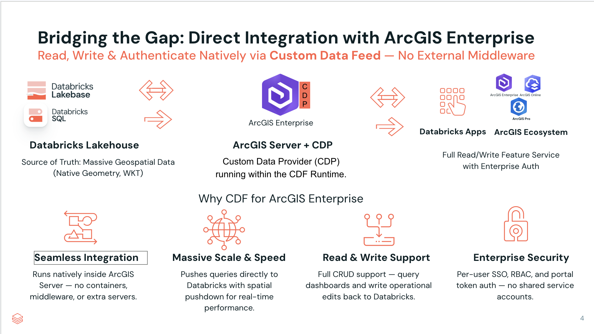

# ArcGIS Custom Data Feed Provider for Databricks

A Node.js Custom Data Provider that publishes Databricks tables as live ArcGIS Server Feature Services. Register it once; each Feature Service picks its backend via service parameters. Two backends:

| Backend | Engine | Best for | Capabilities |
|---------|--------|----------|-------------|
| **Lakehouse** | Databricks SQL Warehouse | Large-scale analytics, complex queries across massive tables | Query |
| **Lakebase** | Databricks Managed PostgreSQL + PostGIS | Low-latency serving (sub-200 ms spatial), interactive maps, feature **editing** | Query + Editing |



> **Install is a lot simpler now.** No build step and no hand-edited JSON: download the prebuilt provider package (`.cdpk`) from the [latest release](../../releases/latest), drop it next to the scripts, and run `sudo bash setup.sh` — it auto-detects the package, registers it, and walks you through publishing your first table. (Building from source is still there for air-gapped boxes and developers.)

---

## Quick Start

Everything runs **on the ArcGIS Server host** (SSH in first), except registering the provider, which you can do in the browser-based Server Manager. The guided **`setup.sh`** wizard does the whole install: it prechecks the environment, then opens a menu — for a fresh box choose **option 5 (Full first-time setup)**, which chains **configure → register → publish** (configure first, so the provider reads your credentials when the register step restarts it) using an ArcGIS admin login it collects once.

```bash
# 0. Get the code onto the ArcGIS Server host (it carries the wizard + the provider source).
git clone <this-repo-url> && cd esri-customdatafeed

# 1. Run the guided wizard — as ROOT (recommended) or the arcgis user (NOT a plain user).
sudo bash setup.sh          # opens a menu -> pick 5 (Full first-time setup): configure -> register -> publish

# 2. If a step ever misbehaves, the read-only health check tells you why:
sudo bash diagnose-service.sh

# 3. Publish more tables later, one wizard per table:
sudo bash publish-service.sh
```

`setup.sh`'s Register step **auto-detects a prebuilt `.cdpk`** sitting next to the scripts and registers it — so on any box (including **air-gapped** ones) you can download the release `.cdpk` (or build it on a connected machine), drop it in, and the wizard registers it with no npm/build. Only if no prebuilt is found *and* the box has npm + registry access does it build one for you instead — see [Manual Setup](#manual-setup). On a **federated** ArcGIS Enterprise it offers Portal-specific guidance under **menu option `F`** (which appears only when a federated Enterprise is detected). For **fully disconnected** environments (no Internet, artifact moved in via an approved path or an internal repo), see **[AIRGAP-INSTALL.md](AIRGAP-INSTALL.md)**.

> You need three things first (details in **[Prerequisites](#prerequisites)**): an **ArcGIS Server 11.4+** (12.0+ for editing), a **Databricks SQL Warehouse**, and **credentials** (a service principal or a PAT) that can read your tables. Full env-var list, the raw REST API, performance, and geometry details all live under **[Reference](#reference)** at the bottom — you won't need them to get running.

> **Running ArcGIS Server on Windows?** These scripts are bash (Linux). Pure-PowerShell ports of the register + configure steps — no Git Bash or WSL needed — live in **[`windows/`](windows/README.md)**. Build the `.cdpk` on Linux or a build box and copy it over; one package runs on any platform.

---

## Prerequisites

1. **An ArcGIS Server, 11.4 or later, with the Custom Data Feed runtime installed.** The CDF runtime is a **separate** component (not bundled with ArcGIS Server) — install `ArcGIS Custom Data Feeds` for your exact server version from My Esri on every machine (Windows/Linux) and restart, or registration fails. It bundles Node.js (don't install Node separately). Use **12.0+** for feature *editing* (not just read-only maps).
2. **A Databricks SQL Warehouse** (left sidebar → SQL Warehouses). This is what the provider queries. *(A Lakebase instance is optional — only needed for very low-latency maps or editing.)*
3. **Databricks credentials** — a **Service Principal (OAuth M2M)** (recommended: a machine identity that auto-refreshes, no user dependency) *or* a **Personal Access Token (PAT)** (simplest for one person). Whichever you use, it needs **both** layers of access granted to that same identity:
   - **Compute:** `CAN USE` on the SQL Warehouse.
   - **Data (Unity Catalog):** `USE CATALOG`, `USE SCHEMA`, and `SELECT` on the specific table/view. *(Lakebase: `CONNECT`/`USAGE`/`SELECT`, plus `INSERT`/`UPDATE`/`DELETE` for editing.)* Grant table-level, not catalog-wide.
4. **Outbound network access** from the ArcGIS Server to Databricks:

   | Destination | Port | Used for |
   |---|---|---|
   | `<workspace>.cloud.databricks.com` | 443 | SQL Warehouse queries + Databricks API |
   | `<instance>.database.cloud.databricks.com` | 5432 | Lakebase queries/edits (only if you use Lakebase) |

   If your workspace uses [IP access lists](https://docs.databricks.com/aws/en/security/network/front-end/ip-access-list), add **each** ArcGIS Server node's outbound IP (create your own ALLOW list — don't edit a fevm/`*-DoNotModify` managed one). Otherwise the connection fails with `HTTP 403`, which surfaces to the publisher as a **misleading `"Service not found"`** — the real `403` appears only in the `Custom_data_feeds` server log. Allow-list changes take a few minutes to propagate.
5. **The Databricks CLI (recommended)** — writes your credential file in Step 3 and helps look up values the publish wizard asks for. Install on the server: `curl -fsSL https://raw.githubusercontent.com/databricks/setup-cli/main/install.sh | sh`. *(No internet on the box? It's one static binary — download it elsewhere and copy it onto the `PATH`.)*

---

## Manual Setup

**`setup.sh` (Quick Start) does all of this for you.** Follow these steps only if you can't use the wizard, want to do it by hand, or need to understand each piece. Each step also maps to a focused script the wizard calls, so this is the fallback for anything the wizard can't complete.

> **Which user runs what:** your SSH user (e.g. `ubuntu`) runs the **build** (`git`, `npm`, `zip`). But the **`.sh` helper scripts** — `setup.sh`, `register-provider.sh`, `configure-databricks.sh`, `publish-service.sh`, `diagnose-service.sh` — must run as **root (`sudo bash …`)** or the **`arcgis`** user: a plain user can't restart the server or read the mode-600, `arcgis`-owned `/home/arcgis/.databrickscfg`. `sudo -u arcgis` starts/stops the server (it runs as the `arcgis` OS user): `sudo -u arcgis /opt/arcgis/server/startserver.sh`. Files you create under the install tree should be `chown arcgis:arcgis`.
>
> **Install root:** Linux defaults to `/opt/arcgis/server/`, but hardened sites often use `/app/arcgis/server/` — check `ls -d /opt/arcgis /app/arcgis 2>/dev/null` and substitute yours. (`setup.sh` and `register-provider.sh` auto-detect `/opt`, `/app`, and home-directory installs; hand-typed commands below do not.)

### 1. Build the provider package (`.cdpk`)

> **Most users don't build.** Grab the prebuilt package matching your ArcGIS Server major version — **`cdpk/12.x/`** (12.0 / 12.1) or **`cdpk/11.x/`** (11.2 – 11.5+) — verify the `SHA-256` against that folder's `.cdpk.sha256`, and register it (Step 2). Build from source only for a **custom version, a code change, or an air-gapped** box.

The provider source lives in the **`nodejs-provider/`** subdirectory. `node_modules/` isn't shipped, so this is the one step that needs a package registry (everything after it is air-gap-friendly).

```bash
cd esri-customdatafeed/nodejs-provider
npm install
# Package as a .cdpk (a zip with a different extension). Keep the excludes EXACTLY as written.
zip -r databricks-geospatial-provider.cdpk \
  cdconfig.json package.json package-lock.json src/ node_modules/ \
  -x '.env' '.env.*' 'test/*' '*.md'
```

> ⚠️ **Don't broaden the excludes to `*.env*`** — it would strip `node_modules` files whose names contain `.env` (a transitive dep of `@databricks/sql`) and the package fails to register.

<details>
<summary><b>Air-gapped, GovCloud, or a broken <code>npm</code> launcher</b></summary>

- **Build anywhere, run on the server.** The provider has **no *required* native modules** — its one native dep (`lz4`) is optional and the driver runs fine without it — so a `.cdpk` built on any OS/arch loads on the Linux server. For a fully offline box, build the `.cdpk` on any machine with registry access, copy it over, and register it via the GUI or `register-provider.sh` **option 2**.
- **GovCloud (`.databricks.mil` / `.databricks.us`) + OAuth M2M:** the bundled `@databricks/sql` hardcodes an OAuth domain allowlist and throws `OAuth is not supported for <host>` on GovCloud. Either **use a PAT** (skips OAuth entirely, works unchanged), or let **`register-provider.sh`'s build (option 1)** widen the allowlist automatically (it re-adds `.mil`/`.us` after `npm install` and fails the build if that didn't take). The widening is outbound-only.
- **`npm` errors with `Cannot find module '../lib/cli.js'`:** the ArcGIS-bundled npm launcher is broken on some installs. Invoke npm through the bundled Node directly (prefix with `sudo -u arcgis` if the binary is owned by `arcgis`):
  ```bash
  /opt/arcgis/server/framework/runtime/node/bin/node \
    /opt/arcgis/server/framework/runtime/node/lib/node_modules/npm/bin/npm-cli.js install
  ```

</details>

<details>
<summary><b>Rebuilding an 11.x package</b></summary>

The prebuilt `cdpk/11.x/` package already covers **11.2 → 11.5+**. To rebuild for a custom version, start from the 12.x manifest (`cdconfig.json`) and: set `arcgisVersion` to **`11.2.0`** (the floor — registers across the whole 11.x line), keep the top-level `editingEnabled`, add `properties.hosts: false` + `properties.disableIdParam: true`, and add a `config/default.json` = `{}` file to the zip (the 11.x CDF runtime requires all three; 12.x auto-defaults them). Windows: `windows/build-cdpk.ps1 -ArcgisVersion 11.2` (plus the config/hosts additions). Register the version-matched package on each server — the 11.x manifest is for 11.x servers, the `12.x` package for 12.x.

</details>

### 2. Register the provider

A **one-time** action telling ArcGIS Server the provider exists. Do it in **ArcGIS Server Manager** (no command line, no tokens):

1. Open **ArcGIS Server Manager** → sign in.
2. **Site (Server Configuration) → Custom Data Feeds → Add Custom Data Provider**.
3. Browse to `databricks-geospatial-provider.cdpk` and confirm.

The **Name** shown — `databricks-geospatial-provider` — is what Feature Services point at. Then **restart ArcGIS Server** so the code loads.

> ⚠️ **Registering installs the provider *code* only — NOT your Databricks credentials.** They're a separate, one-time per-box step ([Step 3](#3-configure-the-databricks-connection)): a `.databrickscfg` file owned by `arcgis`, mode `600`. The publish form only asks for a profile *name*; the secret never goes into ArcGIS (so it can't leak via the admin API or backups). Do Step 3 **before** publishing, and the provider only picks up new credentials **after a server restart** (it caches the file at startup). If you skip this, a published service fails to start with `"Service not found"` and a `SEVERE … workspace profile … not found` line in the server log.

> **Prefer a script?** `sudo bash register-provider.sh` does Build + Register in one wizard (build via option 1, or register an existing `.cdpk` via option 2), auto-detects the install root, updates-vs-registers safely (snapshotting the live provider dir so a failed update can be rolled back), and restarts the server.
>
> **Opening Server Manager from your laptop?** Its file picker sees only the *browser's* machine — `scp` the `.cdpk` down first, or use the CLI/REST path below.

<details>
<summary><b>Register without the GUI (CLI / Admin REST API)</b></summary>

**ArcGIS Enterprise SDK `cdf` CLI** — `cdf register databricks-geospatial-provider.cdpk https://your-server:6443/arcgis/admin` (prompts for `siteadmin`; for self-signed certs set `NODE_EXTRA_CA_CERTS`).

**Admin REST API** — `TOKEN` here is an *ArcGIS Server admin token* (not your Databricks token); `client=requestip` binds it to your IP so no `Referer` header is needed:

```bash
# (a) Mint the admin token (run on the box).
TOKEN=$(curl -sk -X POST 'https://localhost:6443/arcgis/admin/generateToken?f=json' \
  --data-urlencode 'username=siteadmin' --data-urlencode 'password=...' \
  --data-urlencode 'client=requestip' \
  | python3 -c 'import sys,json; print(json.load(sys.stdin)["token"])')
# (b) Upload the .cdpk — the response contains an itemID.
curl -k "https://localhost:6443/arcgis/admin/uploads/upload?token=$TOKEN&f=json" \
  -F "itemFile=@databricks-geospatial-provider.cdpk"
# (c) Register it (first install only; use /update to upgrade).
curl -k "https://localhost:6443/arcgis/admin/services/types/customdataproviders/register?token=$TOKEN&f=json" \
  --data-urlencode "id=ITEM_ID_FROM_UPLOAD_RESPONSE"
```

</details>

<details>
<summary><b>Upgrading or removing the provider later</b></summary>

Registering an existing name is refused. Rebuild the `.cdpk`, then use the provider's **edit/update** in the GUI, or via REST call `/customdataproviders/update` (same upload → `update` instead of `register`). Restart afterward.

**A failed `update` deletes the live provider directory** and your services 404 until a good package is registered — `register-provider.sh` snapshots the dir first so it can roll back. To retire a provider: `/customdataproviders/unregister` with `--data-urlencode "customdataFilename=old-provider-name.cdpk"`.

Registration extracts the `.cdpk` into `<install>/server/framework/runtime/customdata/providers/…` — credentials in `/home/arcgis/.databrickscfg` live outside that dir and survive re-registration.

</details>

### 3. Configure the Databricks connection

The provider reads a standard **`.databrickscfg`** credential file. `sudo bash configure-databricks.sh` writes it atomically, owned by `arcgis`, mode `600` (preserving existing profiles) — or do it with the CLI:

```bash
databricks configure --token          # asks for Host + PAT; writes ~/.databrickscfg [DEFAULT]
databricks current-user me            # confirm it works
# ArcGIS runs as the arcgis user, which reads the file from its own home:
sudo cp ~/.databrickscfg /home/arcgis/.databrickscfg
sudo chown arcgis:arcgis /home/arcgis/.databrickscfg
sudo chmod 600 /home/arcgis/.databrickscfg
```

The provider auto-finds the credential file at `/home/arcgis/.databrickscfg` (Linux) or `%ProgramData%\ArcGIS\cdf\.databrickscfg` (Windows), so a standard install needs **no `DATABRICKS_CONFIG_FILE`** — drop the file there and restart ArcGIS Server. (Set `DATABRICKS_CONFIG_FILE` only if it lives elsewhere.)

A hand-written PAT profile is just:

```ini
[DEFAULT]
host  = your-workspace.cloud.databricks.com
token = dapi_your_pat_here
```

> **Multi-machine sites:** registering the `.cdpk` is site-level (auto-propagates to every node), but `.databrickscfg` is **per-machine** — put the creds on **each** node, or point `DATABRICKS_CONFIG_FILE` (in `init_user_param.sh`) at a shared path. A one-node-only creds install makes the other nodes 404 intermittently.

<details>
<summary><b>Service principal (OAuth M2M, recommended for production) & multiple workspaces</b></summary>

Same file, same location/permissions — only the profile contents differ. Add one section per workspace; each profile uses **one** auth mode.

```ini
[WORKSPACE_A]                                   # PAT
host  = workspace-a.cloud.databricks.com
token = dapiXXXXXXXX

[WORKSPACE_B]                                   # OAuth M2M service principal
host          = workspace-b.cloud.databricks.com
client_id     = <service-principal-client-id>
client_secret = <service-principal-secret>
```

A service created **without** a `workspace` parameter resolves in order: `[DEFAULT]` profile → `DATABRICKS_SERVER_HOSTNAME`+`DATABRICKS_ACCESS_TOKEN` env vars → error. A service with `workspace: "WORKSPACE_B"` uses that profile (isolated connection pool per workspace). For OAuth M2M Lakebase, the provider exchanges `client_id`/`client_secret` at `/oidc/v1/token`, then mints Lakebase tokens via `/api/2.0/database/credentials`, auto-refreshing ~5 min before expiry.

**SP setup** (Databricks account console): create the SP → assign to the workspace → generate an OAuth secret (`client_id`/`client_secret`) → grant `CAN USE` on the warehouse (and Lakebase DB access if used). Ref: [OAuth M2M](https://docs.databricks.com/aws/en/dev-tools/auth/oauth-m2m).

| Symptom | Likely cause |
|---|---|
| `workspace profile "X" not found` | Profile typo (case-sensitive), wrong `DATABRICKS_CONFIG_FILE`, or file not readable by `arcgis` |
| `Profile [X] is ambiguous` | Both PAT and OAuth M2M in one profile — pick one |
| `OAuth M2M token endpoint returned 401` | SP secret wrong/revoked, or SP not assigned to the workspace |
| `Source IP … blocked by Databricks IP ACL` | ArcGIS Server's outbound IP isn't on the workspace allowlist |

</details>

<details>
<summary><b>Lakebase backend setup</b> (skip if you only use Lakehouse)</summary>

Enable PostGIS on each database: `CREATE EXTENSION IF NOT EXISTS postgis;` (without it the first query fails with `function st_intersects does not exist`). Per-table connection details go on each service at publish time. Auth is automatic (the provider mints short-lived Lakebase OAuth tokens; set `LAKEBASE_PASSWORD` in `init_user_param.sh` to use a fixed credential instead).

> **Synced Tables caveat:** Databricks Sync (UC → Lakebase) does **not** carry `GEOMETRY`/`GEOGRAPHY` columns. Store geometry as WKT in a STRING column, sync that, and convert on the Lakebase side — see [Known Limitations](#known-limitations).

</details>

### 4. Publish your feature services

One `publish-service.sh` run per table. It builds the `createService` payload for you — no JSON, no admin token to mint.

```bash
cd ~/esri-customdatafeed        # the repo root (not nodejs-provider/)
sudo bash publish-service.sh
```

It preflights (provider registered? config present?), auto-detects the provider, lists `.databrickscfg` profiles, lets you pick the **backend**, asks for the connection/warehouse **once** then **loops per table**, prompts for **instance sizing** (`min=1`/`max=2` by default — a warm instance per node to avoid the intermittent-404 cold start) and optional **Advanced** visibility/idle settings, then **creates → starts → verifies** each service and prints its FeatureServer URL plus an anonymous-access probe.

> To script the raw REST call yourself, see [Manual service creation](#reference) under Reference. To publish from a Databricks agent, see [Agent-Driven Publishing](#agent-driven-publishing-mcp).

---

## Hardening for Production

> **⚠️ Anonymous access:** by default a published CDF Feature Service is **readable by anyone who can reach the server** — no token required. If that's not what you want, mark the service **private** (the `publish-service.sh` Advanced option denies anonymous `esriEveryone` access), and confirm with the anonymous-access probe the wizard prints. On **federated** ArcGIS Enterprise, access is governed by **Portal item sharing**, not the server's `esriEveryone` lever — set the item's sharing there.

**A standard install needs nothing here** — the provider auto-finds `/home/arcgis/.databrickscfg`. `init_user_param.sh` (typically `/opt/arcgis/server/usr/init_user_param.sh`) is only for **overrides**: a credential file in a non-standard location, or optional tuning.

```bash
# Only if your .databrickscfg is NOT at ~/.databrickscfg or /home/arcgis/.databrickscfg:
export DATABRICKS_CONFIG_FILE=/shared/path/.databrickscfg
# Optional default SQL Warehouse (the publish wizard sets it per-service):
export DATABRICKS_HTTP_PATH=/sql/1.0/warehouses/your-warehouse-id
```

Restart ArcGIS Server after editing it. Credentials stay in `.databrickscfg`, not here.

<details>
<summary><b>Optional tuning knobs & admin-token binding (requestip vs referer)</b></summary>

Tuning (leave at defaults unless needed): `DATABRICKS_MAX_RECORD_COUNT`, `DATABRICKS_QUERY_TIMEOUT`, `DATABRICKS_USE_CLOUDFETCH`, `DATABRICKS_TILE_QUERY_TIMEOUT`, `DATABRICKS_MAX_RETURN_IDS`, `ENABLE_AUDIT_LOG`, pool sizes — see [Environment Variables](#reference).

**Admin-token binding:** `client=requestip` (used throughout this guide) ties the token to your IP — no `Referer` header on admin calls, simplest on the box. `client=referer` ties it to a URL and **every** admin call must send a matching `Referer` header (mismatch → `HTTP 498`). Note: a feature-service `/query` validates more strictly and may reject a `requestip` token — query it with a `referer`-bound token **plus** a matching `Referer` header (the publish wizard does this for its verify step).

</details>

---

## Supported Operations

**Query (both backends):** `where`, `objectIds`, `geometry`+`spatialRel` (intersects/contains/within/crosses/overlaps/touches), `outFields`, `resultRecordCount`+`resultOffset`, `orderByFields`, `returnCountOnly`, `returnGeometry`. **Lakehouse also:** `returnDistinctValues`, `time` (needs `timeColumn`), and multiple geometry storage formats.

**Editing (Lakebase only, `applyEdits`):** Add (auto-generated IDs), Update (by OBJECTID), Delete (per-row failure reporting). Set `rollbackOnFailure=true` to wrap all ops in one transaction. Requires `capabilities: "Query,Editing"` + `editingEnabled: "true"` at publish, and ArcGIS Server 12.0+.

---

## Performance: Lakebase vs Lakehouse

Benchmark on 17M Overture Maps Places, warm averages, end-to-end through ArcGIS Server REST:

| Query Type | Lakebase | Lakehouse | Speedup |
|---|---|---|---|
| Spatial: city block (~1k) | **120 ms** | 3,566 ms | **29.7×** |
| Spatial: DC metro (~2k) | **152 ms** | 4,466 ms | **29.4×** |
| Spatial count (DC metro) | **185 ms** | 2,197 ms | **11.9×** |
| objectIds lookup (5) | **32 ms** | 357 ms | **11.2×** |
| Attribute `LIKE '%Starbucks%'` | **47 ms** | 499 ms | **10.6×** |
| COUNT (full table) | 636 ms | **150 ms** | Lakehouse 4.2× |

**Lakebase is 8–30× faster for spatial** (PostGIS GIST indexes vs file-level scanning) and all queries are sub-200 ms (interactive). **COUNT is the one case Lakehouse wins** (columnar stats). Config: Lakebase CU_4 + GIST, Lakehouse Large Serverless (Z-ordered), ArcGIS 12.0 on m5.xlarge.

---

## Working with Existing Tables

**Already have a geometry column?** Point `geometryColumn` at it (any supported format; set `geometryFormat` if the name doesn't make it obvious).

**Only `latitude`/`longitude` columns?** Create a view and point the service at it:

```sql
-- Lakehouse
CREATE VIEW catalog.schema.my_table_geo AS
SELECT *, ST_Point(longitude, latitude, 4326) AS geometry   -- lon, lat, SRID
FROM catalog.schema.my_table WHERE latitude IS NOT NULL;

-- Lakebase
CREATE VIEW public.my_table_geo AS
SELECT *, ST_SetSRID(ST_MakePoint(longitude, latitude), 4326) AS geometry
FROM public.my_table WHERE latitude IS NOT NULL;
```

> **⚠️ Always stamp the SRID.** Databricks `ST_Point(lon, lat)` / `ST_GeomFromText(wkt)` **default to SRID 0**, which ArcGIS can't project — features come back with attributes but **no geometry**. Use `ST_Point(lon, lat, 4326)` (or `ST_SetSRID(…, 4326)`) so the column reads `geometry(4326)`, matching the service's `srid` param. (Details in [Troubleshooting](#troubleshooting).)

---

## Troubleshooting

> **Fastest first step: `sudo bash diagnose-service.sh`.** A read-only health check — give it a service name and it reports the provider, service state, `min/max` instances, `tableName`/`idField`/geometry, per-machine instance stats, a live query smoke test, and a plain-English assessment. It flags the common failures automatically (stopped service, `minInstancesPerNode=0` intermittent-404, federated token contract). On a federated server it can mint a Portal token for a definitive query if you give it a Portal login.

<details>
<summary><b>Register/update fails, or "Cannot find module '../adapters/process.env'"</b></summary>

Your `.cdpk` was built with an overbroad exclude (e.g. `-x '*.env*'`) that stripped `node_modules` files. Rebuild with the exact excludes from [Step 1](#1-build-the-provider-package-cdpk). A failed `update` deletes the live provider dir — upload a good `.cdpk`, run `update` again, restart.

</details>

<details>
<summary><b>Service shows STARTED in admin but HTTP 404 from REST</b></summary>

Provider init failed silently. Tail the server log for `Custom_data_feeds` lines — usually a missing/expired credential, a `.databrickscfg` profile name mismatch, or an unreachable warehouse. (On a **federated** server a `/query` 404/500 with a *server* token can just be the token contract — verify with a Portal token; `diagnose-service.sh` distinguishes these.)

</details>

<details>
<summary><b>HTTP 498 (Invalid token) / HTTP 403 on first query / timeouts</b></summary>

- **498 on admin calls:** you used `client=referer` without a matching `Referer` header — simplest fix is `client=requestip`. **498 on `/query`:** use a `referer` token + matching header.
- **403 `Source IP … blocked`:** add the ArcGIS Server's outbound IP to the workspace IP access list. **403 `Invalid access token`:** the PAT/SP is expired/revoked — refresh it and restart the server.
- **`ECONNREFUSED`/`ETIMEDOUT`:** a firewall is blocking outbound 443 (or 5432 for Lakebase) — see [Prerequisites](#prerequisites).

</details>

<details>
<summary><b>Intermittent 404 "works on refresh" / no data / OBJECTID issues / editing / slow queries</b></summary>

- **404 that recovers on refresh:** `minInstancesPerNode=0` keeps no warm instance — set `min=1`, `max≥2` (per service; `setup.sh` option 9 does it in place).
- **Updated `.databrickscfg` but change ignored:** the provider caches it at first read — **restart ArcGIS Server** after any edit.
- **No data:** verify the fully-qualified table name + geometry column; test the warehouse independently.
- **OBJECTID:** `idField` must be an integer ≤ 2,147,483,647 with unique values.
- **Editing fails:** `capabilities:"Query,Editing"` + `editingEnabled:"true"` both set; `lakebaseHost` present (editing is Lakebase-only); ArcGIS 12.0+. On federated Portal, the user's role needs "Edit features".
- **Lakebase service 404s (native login):** a native-login table (`LAKEBASE_USER`/`LAKEBASE_PASSWORD`) needs `workspace` set to a **PAT** profile. With an **OAuth-M2M** profile the provider uses the SP `client_id` as the Postgres user instead — wrong user, so the FeatureServer 404s with no logged error.
- **Slow:** Lakehouse cold start (5–15 s) after idle; add `OPTIMIZE … ZORDER BY (geom)` (Lakehouse) or `CREATE INDEX … USING GIST (geom)` (Lakebase).

</details>

<details>
<summary><b>Features have attributes but no geometry (nothing draws in Portal / Map Viewer)</b></summary>

The source geometry has **SRID 0** (undefined spatial reference). ArcGIS can't project it, so features come back with attributes but null geometry — a raw REST `/query` still returns the attribute rows, which masks the problem and makes it look like a Portal-only issue. Cause: geometry built without an SRID — Databricks `ST_Point(lon, lat)` / `ST_GeomFromText(wkt)` default to **SRID 0**, so the column is `geometry(0)`. Fix: stamp the SRID in the source view/table — `ST_Point(lon, lat, 4326)` or `ST_SetSRID(ST_Point(lon, lat), 4326)` — confirm the column reads `geometry(4326)` (`SELECT DISTINCT ST_SRID(geometry) FROM …`) and matches the service's `srid` param (`4326`). This is a **data** change to the source, so it's picked up on the next query — **no server restart needed** (responses aren't cached; only the geometry *format* — WKT/WKB/GEOMETRY, not SRID — is cached per column, so a restart is only needed if you change the storage *format* or credentials). Just hard-refresh Map Viewer (it caches layer metadata). Note: a *wrong-but-valid* SRID instead renders features in the wrong place (Null Island), not missing.

</details>

<details>
<summary><b>Sanity-check the whole install in one command</b></summary>

```bash
# Set ROOT to your install root (/opt/arcgis default; /app/arcgis on hardened boxes).
sudo ROOT=/opt/arcgis bash -c '
P="$ROOT/server/framework/runtime/customdata/providers/databricks-geospatial-provider"
echo "=== Provider dir ==="; ls -la "$P/"
echo "=== Provider .env (redacted) ==="; [ -f "$P/.env" ] && sed -E "s/(TOKEN|PASSWORD|SECRET) *= *.+/\1=<REDACTED>/g" "$P/.env" || echo "(none)"
echo "=== init_user_param.sh (redacted) ==="; sed -E "s/(TOKEN|PASSWORD|SECRET) *= *.+/\1=<REDACTED>/g" "$ROOT/server/usr/init_user_param.sh" 2>/dev/null
echo "=== .databrickscfg (redacted) ==="; sed -E "s/(token|client_secret) *= *.+/\1 = <REDACTED>/g" /home/arcgis/.databrickscfg 2>/dev/null
echo "=== recent Custom_data_feeds log lines ==="; ls -t "$ROOT"/server/usr/logs/*/server/server-*.log 2>/dev/null | head -1 | xargs grep -E "Custom_data_feeds|Pool " 2>/dev/null | tail -10
'
```

</details>

---

## Known Limitations

**Lakebase Synced Tables don't support GEOMETRY/GEOGRAPHY.** Databricks [Synced Tables](https://docs.databricks.com/aws/en/oltp/instances/sync-data/sync-table) (UC → Lakebase reverse-ETL) fail if the source table has geometry columns. **Workaround:** store geometry as WKT strings (STRING → TEXT) in the source Delta table, sync that, then convert on the Lakebase side:

```sql
-- Convert at query time:
SELECT *, ST_GeomFromText(geometry_wkt, 4326) AS geom FROM my_table;
-- Or a generated column + index:
ALTER TABLE my_table ADD COLUMN geom GEOMETRY(Point, 4326)
  GENERATED ALWAYS AS (ST_GeomFromText(geometry_wkt, 4326)) STORED;
CREATE INDEX ON my_table USING GIST (geom);
```

Tables created directly in Lakebase with native PostGIS geometry work fine.

**PBF feature tiles are on.** Clients get quantized PBF tiles (about 3–9× smaller than JSON), which render in Map Viewer and the JS SDK on ArcGIS 12.1. Versions 1.1.3–1.1.4 turned PBF off after large layers drew blank in Map Viewer; that turned out to be the provider's own Web Mercator tile-geometry bug (fixed in 1.1.3), not the ArcGIS runtime. The old `enablePbf` service parameter is ignored and kept only so existing services validate.

**Set a time column for anything with history.** Without one the layer isn't time-enabled, and Map Viewer and other clients request every date in each tile — a full scan on a large multi-year table, slow enough to back up every service on the server. With one, the provider reports the data's time range (computed once and cached), clients show a time slider, and they query one interval at a time. The publish wizard suggests a DATE/TIMESTAMP column and asks you to confirm before publishing without one.

**Polygons and lines crossing the 180° meridian** are unwrapped on output (negative longitudes shifted by +360 for that shape), so they no longer draw as bands across the map. Filters still run against the stored geometry.

---

## Agent-Driven Publishing (MCP)

 An MCP server (`mcp-server/`) that turns provider setup and per-layer publishing into a conversation — an agent inspects the Unity Catalog table (geometry, SRID, a validated int32 id), publishes it, smoke-tests it, and returns the FeatureServer URL.

<details>
<summary><b>Quickstart & tools</b></summary>

```bash
cd esri-customdatafeed/mcp-server && npm install
claude mcp add databricks-cdf -- node "$(pwd)/bin/cli.js" serve
```

Then, in the client: register your ArcGIS target (password set via a terminal command, never typed into chat) → install the provider → *"publish catalog.schema.my_table"*. Key tools: `register_gis_target`, `provider_status`, `register_provider` (build/install/upgrade, env baked in), `inspect_table`, `create_publish_view`, `publish_layer`, `list_layers`, `unpublish_layer`. Credentials never pass through chat (resolved server-side from `env:`/`secret:` refs). Can be hosted as a Databricks App for Playground/Genie. Full details: [`mcp-server/README.md`](mcp-server/README.md).

</details>

---

## Reference

<details>
<summary><b>Manual service creation (Admin REST API) + parameters</b></summary>

`publish-service.sh` builds and submits this for you. Creating a service is a REST call per table (`/createService`); the presence of `lakebaseHost` selects the backend. Source-table requirements: `idField` is a unique integer 0–2,147,483,647; geometry uses `lon lat` order; Lakehouse table names are fully qualified (`catalog.schema.table`).

**Lakehouse parameters:** `workspace` (profile; default env), `warehouseHttpPath` (default `DATABRICKS_HTTP_PATH`), `tableName` (required), `geometryColumn` (`geometry`), `idField` (`id`), `geometryFormat` (auto: `WKT`/`WKB`/`GEOJSON`/`GEOMETRY`), `timeColumn`, `maxRecordCount` (`2000`), `srid` (`4326`), `minScale` (optional; see below).

**Lakebase parameters:** `workspace`, `lakebaseHost` (required, selects Lakebase), `lakebasePort` (`5432`), `lakebaseDatabase` (required), `lakebaseSchema` (`public`), `lakebaseTable` (required), `geometryColumn`, `idField`, `maxRecordCount`, `srid`, `editingEnabled` (`false`), `minScale`.

**`minScale` (optional, both backends):** the most zoomed-out view at which clients draw the layer, as a scale (`577791`) or a zoom level (`zoom 10`). It's advertised as standard layer metadata, so Map Viewer, Pro and the JS SDK stop requesting features when zoomed out further. For point tables, by row count:

| Rows | Suggested `minScale` |
|---|---|
| under 10 million | none (`-`) |
| 10 million – 1 billion | `zoom 8` (≈1:2,311,000, a metro region) |
| over 1 billion, clients send a time window | `zoom 8`–`zoom 10` (≈1:2,311,000–1:578,000) |
| over 1 billion, clients may not send one (e.g. a layer opened straight from its URL) | `zoom 11`–`zoom 12` (≈1:289,000–1:144,000, a harbor) |

Measured on 28B AIS points: a ten-year feature tile at zoom 11 took 2–8 s once ordering was dropped; at continental zooms each tile scans far more. Polygon/H3 density layers usually need none.

**Fill one set, not both.** A read-only **Lakehouse** service uses the Lakehouse fields; an editable **Lakebase** service uses the Lakebase fields. Setting `lakebaseHost` is what switches the backend to Lakebase. `workspace`, `geometryColumn`, `idField`, `srid`, `maxRecordCount` are shared. The publish-form field labels are grouped and numbered — `Common`, `Lakehouse`, `Lakebase` — so you can see at a glance which set each belongs to.

> **Leaving fields empty — REST vs the Portal form.** The Admin REST call accepts empty strings for the fields that don't apply (shown below). The **Portal "Create a feature layer" form, however, requires *every* field** (Esri marks all provider parameters required — a blank field silently blocks the form). So in the GUI, enter **`-`** in each inapplicable field. The provider treats `-` (and `na`, `n/a`, `none`, or whitespace, case-insensitive) as *unset*, so a `-` in `lakebaseHost` keeps the service on Lakehouse. Defaults still apply to `srid` (4326), `maxRecordCount` (2000), `lakebasePort` (5432), and `lakebaseSchema` (public) when you enter `-`.

```bash
curl -k "https://localhost:6443/arcgis/admin/services/createService?token=$TOKEN&f=json" \
  --data-urlencode 'service={
    "serviceName": "MyCellTowers", "type": "FeatureServer",
    "capabilities": "Query", "provider": "CUSTOMDATA", "clusterName": "default",
    "minInstancesPerNode": 1, "maxInstancesPerNode": 2, "instancesPerContainer": 1,
    "configuredState": "STARTED", "properties": {"disableCaching": "true"},
    "jsonProperties": {"customDataProviderInfo": {
      "dataProviderName": "databricks-geospatial-provider",
      "serviceParameters": {
        "workspace": "", "warehouseHttpPath": "",
        "tableName": "catalog.schema.us_cell_towers",
        "geometryColumn": "geometry", "idField": "id", "geometryFormat": "WKT",
        "timeColumn": "", "lakebaseHost": "", "lakebasePort": "", "lakebaseDatabase": "",
        "lakebaseSchema": "", "lakebaseTable": "", "maxRecordCount": "2000",
        "srid": "4326", "editingEnabled": "", "minScale": ""
      }
    }}
  }'
```

For a Lakebase read+write service: `"capabilities": "Query,Editing"`, set `lakebaseHost`/`lakebaseDatabase`/`lakebaseTable`, and `"editingEnabled": "true"`. Routing: `getData` picks Lakebase iff `lakebaseHost` is set; `editData` is always Lakebase.

> **If you script this yourself, prefer `"configuredState": "STOPPED"` then a separate `services/<name>.FeatureServer/start` call** (what `publish-service.sh` does). Creating with `STARTED` makes ArcGIS start the instance synchronously inside `createService`, which — right after a server restart — can race the service container (port 6843) and fail the whole create with `Connect to localhost:6843 … Connection refused`. Create STOPPED, then start.

</details>

<details>
<summary><b>Spatial functions by backend</b></summary>

| Relation | Lakehouse | Lakebase (PostGIS) |
|---|---|---|
| Intersects / Contains / Within / Touches | native `ST_*` | native `ST_*` |
| Overlaps | DE-9IM workaround (5 fns) | `ST_Overlaps` |
| Crosses | DE-9IM workaround (7 fns) | `ST_Crosses` |

Databricks SQL lacks native `ST_Overlaps`/`ST_Crosses`, so the provider builds DE-9IM equivalents (see `nodejs-provider/src/modules/geometry.js`).

</details>

<details>
<summary><b>Geometry support & format detection</b></summary>

All types: Point, MultiPoint, LineString, MultiLineString, Polygon, MultiPolygon. **Lakehouse** supports four storage formats — native `GEOMETRY` (fastest, recommended for new tables), `WKB` (BINARY), `WKT` (STRING, human-readable, required for Lakebase Synced Tables), `GEOJSON` (STRING). Detection priority: explicit `geometryFormat` param → column-name hints (`geometry_wkt`→WKT) → schema probe (`STRING`→WKT, `BINARY`→WKB, else native). **You MUST set `geometryFormat: "GEOJSON"`** for GeoJSON in a generically-named STRING column (the probe would guess WKT). **Lakebase** uses native PostGIS only.

</details>

<details>
<summary><b>Environment variables (full list)</b></summary>

Set in `init_user_param.sh`. Per-table settings are NOT here (they're per-service).

| Variable | Description |
|---|---|
| `DATABRICKS_SERVER_HOSTNAME` / `DATABRICKS_HTTP_PATH` / `DATABRICKS_ACCESS_TOKEN` | Lakehouse connection (env-var fallback when not using `.databrickscfg`) |
| `DATABRICKS_CONFIG_FILE` | Override the `.databrickscfg` path. Auto-found in the service-account home — `/home/arcgis/.databrickscfg` (Linux) or `%ProgramData%\ArcGIS\cdf\.databrickscfg` (Windows); set only if the file is elsewhere |
| `LAKEBASE_PASSWORD` / `LAKEBASE_USER` / `LAKEBASE_INSTANCE_NAME` | Lakebase connection (token auto-generated if omitted) |
| `DATABRICKS_MAX_RECORD_COUNT` (`2000`) / `DATABRICKS_QUERY_TIMEOUT` (`120000`) / `DATABRICKS_SRID` (`4326`) | Query defaults |
| `DATABRICKS_USE_CLOUDFETCH` (`false`) | `true` lets the driver download large results from presigned cloud-storage URLs. Leave off unless the ArcGIS host can reach the workspace's storage bucket: a refused download (403) crashed the whole CDF process with @databricks/sql 1.12.0. Results come back inline when off; CDF pages are far below the size where that matters. |
| `DATABRICKS_TILE_QUERY_TIMEOUT` (`30000`) | Cancel a feature-tile query (`resultType=tile`) after this many ms; `0` disables. ArcGIS Server doesn't pass a browser's abort to the CDF, so an abandoned tile otherwise runs until the statement timeout. Sessions also get a warehouse-enforced `STATEMENT_TIMEOUT` from `DATABRICKS_QUERY_TIMEOUT` (`120000`). |
| `DATABRICKS_MAX_RETURN_IDS` (`500000`) | Ceiling on how many object ids a `returnIdsOnly` request may return. Such requests carry no page limit (clients expect every matching id), so on a very large table they can return millions of ids inline — with CloudFetch off, that memory lands in the CDF process. If a request would exceed this, it **errors** (asking the caller to narrow the query with `where`/`time`/`geometry`) rather than returning a truncated, wrong id set. Raise it if a box has memory to spare and genuinely needs larger selections; set `0` to disable the ceiling. |
| `DATABRICKS_POOL_MIN`/`MAX` (`2`/`10`) · `LAKEBASE_POOL_MIN`/`MAX` (`2`/`10`) · `LAKEBASE_SSL_VERIFY` (`false`) | Pool tuning |
| `ENABLE_USER_AUTH` / `ENABLE_AUDIT_LOG` / `DATABRICKS_API_SSL_VERIFY` | Security |

</details>

<details>
<summary><b>Where configuration lives (.databrickscfg; init_user_param.sh = overrides only)</b></summary>

One file: **`.databrickscfg`**, auto-found at `/home/arcgis/.databrickscfg` (Linux) or `%ProgramData%\ArcGIS\cdf\.databrickscfg` (Windows) — its INI sections are your workspace profiles, and the publish form only names a profile. `init_user_param.sh` (Linux) or a Machine env var (Windows) is optional, for overrides: a non-standard config path, or pool/timeout tuning.

</details>

<details>
<summary><b>Running the unit tests</b> (contributors)</summary>

```bash
cd esri-customdatafeed/nodejs-provider && npm test   # 405 passing (mocha + chai)
```
Exercises the SQL builders, geometry handling, sanitization, and workspace resolver in isolation — not a live deployment.

</details>

---

## License

MIT
